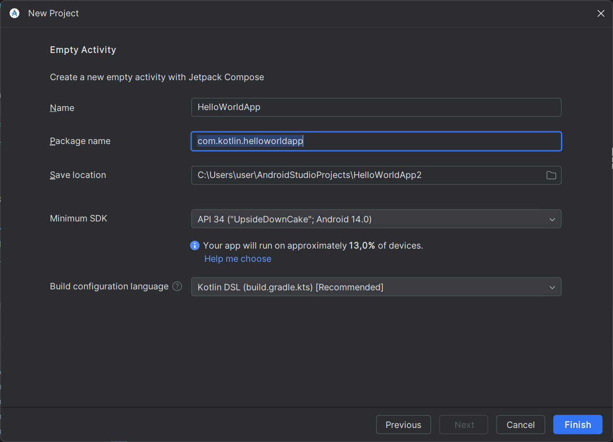
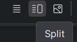
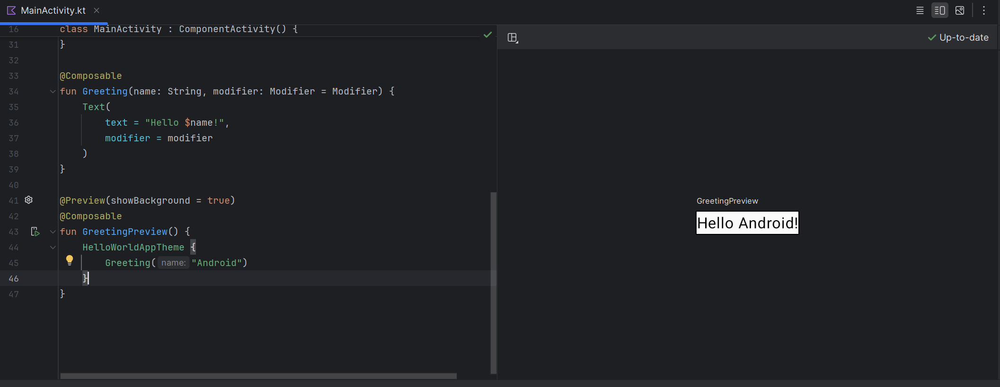

# 📚 Практический урок: Создаем  Android-приложение

Вы научитесь:

* Создавать новый проект в Android Studio.
* Использовать Jetpack Compose для создания пользовательского интерфейса.
* Применять компоненты Material Design для стилизации приложения.
* Изменять текст и стили текста.
* Работать с цветами и темами.

---

## 🎯 Цели урока

* **Создать приложение "Привет, мир!" с использованием Jetpack Compose.**
* **Изменить текст на свое имя и настроить стиль текста.**
* **Изменить цвет фона и применить тему Material Design.**

---

## 🛠 Шаг 1: Создание нового проекта в Android Studio

1. \** Android Studio:\*\*
   

* Запустите Android Studio на вашем компьютере.

2. **Создайте новый проект:**
   

* В окне приветствия нажмите **"New Project"** (Новый проект).

1. **Выберите шаблон "Empty Activity":**
   

* В списке шаблонов выберите **"Empty Activity"**.
* Нажмите **"Next"**.

2. **Настройка проекта:**
   
   
   * **Name (Имя):** Введите **"HelloWorldApp"**.
   * **Package name:** Оставьте как есть или измените по своему желанию **"com.example.helloworldapp"**.
   * **Save location:** Выберите папку для сохранения проекта.
   * Нажмите **"Finish"**.

---

## 📝 Рассмотрим код по умолчанию, как и говорилось ранее MainActivity.kt основной файл проект использует уже знакомый нам язык kotlin.

По умолчанию создается файл с уже готовой реализацией приложения выводящего на экран текст с фразой HelloWorld.

````kotlin
package com.kotlin.helloworld

import android.os.Bundle
import androidx.activity.ComponentActivity
import androidx.activity.compose.setContent
import androidx.activity.enableEdgeToEdge
import androidx.compose.foundation.layout.fillMaxSize
import androidx.compose.foundation.layout.padding
import androidx.compose.material3.Scaffold
import androidx.compose.material3.Text
import androidx.compose.runtime.Composable
import androidx.compose.ui.Modifier
import androidx.compose.ui.tooling.preview.Preview
import com.kotlin.helloworld.ui.theme.HelloWorldAppTheme

class MainActivity : ComponentActivity() {
    override fun onCreate(savedInstanceState: Bundle?) {
        super.onCreate(savedInstanceState)
        enableEdgeToEdge()
        setContent {
            HelloWorldAppTheme {
                Scaffold(modifier = Modifier.fillMaxSize()) { innerPadding ->
                    Greeting(
                        name = "Android",
                        modifier = Modifier.padding(innerPadding)
                    )
                }
            }
        }
    }
}

@Composable
fun Greeting(name: String, modifier: Modifier = Modifier) {
    Text(
        text = "Hello $name!",
        modifier = modifier
    )
}

@Preview(showBackground = true)
@Composable
fun GreetingPreview() {
    HelloWorldAppTheme {
        Greeting("Android")
    }
}
````
*   **`androidx.activity.ComponentActivity`:**  Базовый класс для Activity, использующих Compose.
*   **`androidx.activity.compose.setContent`:**  Функция, которая устанавливает composable-функцию в качестве корневого UI для Activity.
*   **`HelloWorldTheme`:**  Тема приложения (цвета, шрифты, формы).  Определена в папке `ui/theme`.
*   **`Surface`:**  Composable-функция, которая представляет собой область на экране с определенным цветом фона (из темы).
*   **`Modifier.fillMaxSize()`:**  Заставляет `Surface` занять весь экран.
*   **`Greeting("Android")`:**  Вызов нашей composable-функции `Greeting`.
*   **`@Preview`:** Аннотация Preview, о которой мы говорили ранее.
*  **`MaterialTheme`:** Composable-функция, которая предоставляет доступ к цветам, шрифтам, фигурам в соответсвии с Material Design.

**Рассмотрим подробнее:**

````kotlin
class MainActivity : ComponentActivity() {
````

* **`MainActivity`** наследуется от `ComponentActivity`.

````kotlin
setContent {
            HelloWorldAppTheme {
                Scaffold(modifier = Modifier.fillMaxSize()) { innerPadding ->
                    Greeting(
                        name = "Android",
                        modifier = Modifier.padding(innerPadding)
                    )
                }
````

\*\*@**Composable** Function В Jetpack Compose Composable функции используются для программного определения всего пользовательского интерфейса вашего приложения.

Таким образом, вам не нужно использовать какие-либо XML-файлы для компоновки приложения. Все, что вам нужно для создания составной функции, - это просто использовать аннотацию **@Composable** к названию функции. Основной синтаксис составной функции таков:\*\*

- **fun Greeting(name: String) { ... }** - **объявление Composable функции с именем Greeting, принимающей параметр name типа String (текст).**
    
- **Text(text = "Hello $name!")** - **внутри функции Greeting вызывается другая Composable функция - Text**. Text – это **Composable функция от Google**, которая предназначена **для отображения текста на экране.**
    
    - text = "Hello $name!" - это **аргумент** (или параметр) функции Text. Здесь мы **указываем, какой текст нужно отобразить.** "Hello $name!" - это **текстовая строка с интерполяцией** – $ перед name позволяет **вставить значение переменной name внутрь текста.**

````kotlin
@Composable
fun AnyUiComponent() {
    // Code for UI element
}
````

* **`setContent {}`** устанавливает содержимое для вывода на экран с помощью функций Compose.  **это "точка входа" для Jetpack Compose UI в Activity.** Всё, что мы пишем внутри **{ ... }** – это описание интерфейса, который Compose нарисует на экране.

````kotlin
HelloWorldAppTheme {
    
                }
````

Применяет тему Material Design по верх содержимого.

-**\` Scaffold(modifier = Modifier.fillMaxSize()) {}**
компонент макета в Jetpack Compose, который устанавливает общую структуру страницы.

**TopBar.** Здесь можно включить верхнюю панель навигации приложения.

**BottomBar.** Раздел для размещения нижней панели навигации.

**FloatingActionButton.**
Кнопка, которая часто используется для запуска основного действия.

**Drawer.** Боковое меню, которое можно открывать и закрывать для показа дополнительных опций навигации.

**Content.** Основное тело приложения, которое отображает основные элементы интерфейса.

**Preview .** Android Studio предоставляет  возможность предварительного просмотра компонентов пользовательского интерфейса в самой Studio, причем динамически.

````kotlin
@Composable
fun SimpleText(displayText: String) {
    Text(text = displayText)
}

@Preview
@Composable
fun SimpleTextPreview() {
    SimpleText("Preview text")
}
````

Итак, всякий раз, когда вы хотите протестировать какие-либо компоненты пользовательского интерфейса, вы можете просто предварительно просмотреть их в Android Studio, создав компонуемую функцию и используя аннотацию @Preview.

````kotlin
Greeting(
                        name = "Android",
                        modifier = Modifier.padding(innerPadding)
                    )
````

**`Greeting("Android")`** — вызывает compose-функцию `Greeting`. **это пример "Composable" функции.** **Composable функция – это основная "строительная единица" в Jetpack Compose.** Это функция, которая **описывает часть UI** (кнопку, текст, картинку, целый экран и т.д.) и **может вызываться внутри setContent и внутри других Composable функций.**

````kotlin
@Composable
fun Greeting(name: String, modifier: Modifier = Modifier) {
    Text(
        text = "Hello $name!",
        modifier = modifier
    )
}
````

* **`Compose Функция Greeting`** отображает текст **"Hello Android!"**. (Hello с передаваемым именем $android) Чтобы отобразить текст, мы используем Text Composable и внутри него передаем строку, которую хотим отобразить.

````kotlin
@Preview(showBackground = true)
@Composable
fun GreetingPreview() {
    HelloWorldAppTheme {
        Greeting("Android")
    }
}
````

* **`@Preview(showBackground = true)`** блок содержит продублированный вызов, для вывода превью до сборки приложения.



**Для вызова превью нажмите значок split или design**

Превью отобразит пример работы выбранных элементов, но только тех которые продублированны в блок превью.

## 📚 Полезные ресурсы

* [Учебное пособие по Android Studio](https://developer.android.com/studio/platform/tutorial)

* [Как создать приложение для Android](https://skyeng.ru/it-industry/programming/kak-sozdat-prilozhenie-dlya-android-s-nulya/)

## 🎥 Видео материалы

[](https://www.youtube.com/watch?v=DzqfBxlvANQ&list=PLgPRahgE-GctUcLMcQFvl00xsXqpNJOix)
