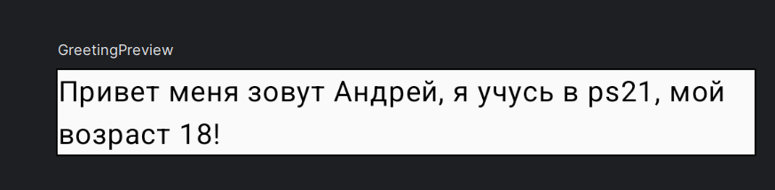
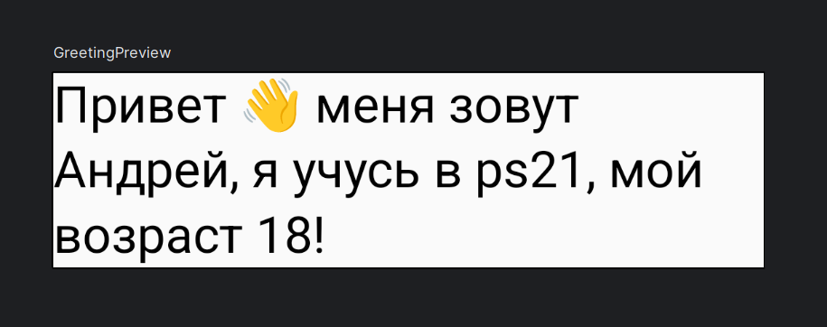
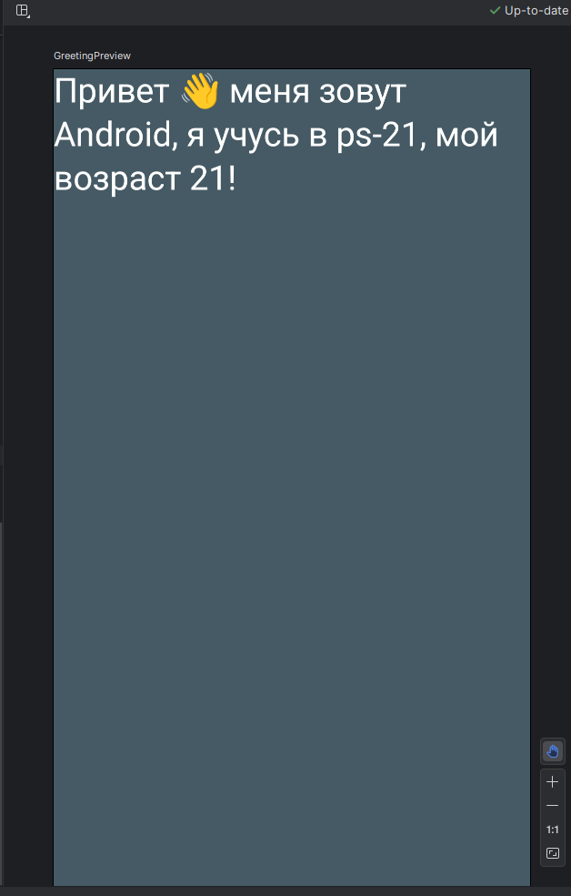
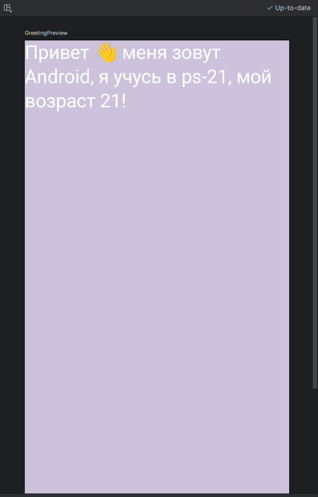

**Измените вызов функции `Greeting`:**

**Измените text = "Привет, меня зовут $name, я учусь в группе !",**\*\*
На
**Greeting("ФИО Группа Возраст")**

Вместо `" ФИО Группа Возраст"` введите свои данные.


Пример вывода.

🎨 Далее дополним стилями Material Design

**Для этого вверх нашего документа в импорт добавим компоненты Material Design:**

````kotlin
   import androidx.compose.material3.MaterialTheme
   import androidx.compose.material3.Typography
````

**Изменим функцию `Greeting`:**

````kotlin
   @Composable
   fun Greeting(name: String, group:String, age:Int,  modifier: Modifier = Modifier) {
    Text(
        text = "Привет 👋 меня зовут $name, я учусь в $group, мой возраст $age!",
        modifier = modifier.padding(20.dp),
                style = MaterialTheme.typography.headlineMedium, color = White
    )
}
````

Теперь текст будет отображаться с использованием стиля `headlineMedium` из Material Design белым цветом. Аналогично можно применять другие свойства к тексту.

````kotlin
@Composable
fun SetTextStyling(displayText: String, style: TextStyle? = null, maxLines: Int? = null) {
    Text(
        text = displayText,
        modifier = Modifier.padding(16.dp),
        style = style ?: TextStyle.Default,
        overflow = TextOverflow.Ellipsis,
        maxLines = maxLines ?: Int.MAX_VALUE
    )
}
style = TextStyle(
    fontSize = 24.sp
    fontWeight = FontWeight.Bold
)
````


**До**

**После**

## ⬜🟨 Измененим цвета фона

**Импортируйте дополнительные компоненты:**

````kotlin
    import androidx.compose.foundation.background
    import androidx.compose.foundation.layout.Box
    import androidx.compose.foundation.layout.fillMaxSize
    import androidx.compose.ui.graphics.Color
````

**Изменим содержимое экрана через `setContent` в `MainActivity`:**

````kotlin
class MainActivity : ComponentActivity() {
    override fun onCreate(savedInstanceState: Bundle?) {
        super.onCreate(savedInstanceState)
        enableEdgeToEdge()
        setContent {
            HelloWorldAppTheme {
               FIO()
            }
        }
    }
}
````

**Внутри `setContent  HelloWorldAppTheme` оборачивает темой для изменения внешнего вида вызов функции в которую мы перенесем вывод данных `{                FIO()             }`**

**Для этого  с использованием Scaffold создадим новую функцию пример FIO, куда перенесем предыдущую реализацию.**

````kotlin
@Composable
fun FIO() {
    Scaffold(

    ) { innerPadding ->
        Box(
            modifier = Modifier
                .padding(innerPadding)
                 .background(Color(0xFF455A64)) // графитовый цвет
                .fillMaxSize()
        ) {
                Greeting(
                    // Собственная реализация вывода FIO
                    modifier = Modifier.padding(innerPadding)
                )
        }
    }
}

````

**Box** Box/Прямоугольник - это composable  макет, который используется для размещения дочерних элементов относительно его краев.

Первоначально вместо прямоугольника использовался Stack. Но теперь Stack устарел и вместо него появился Box.

Как следует из названия, дочерние элементы размещаются внутри родительского элемента.

Дочерние элементы внутри прямоугольника рисуются в указанном порядке, и если дочерние элементы меньше родительского элемента, то они будут размещены внутри прямоугольника по умолчанию в соответствии с выравниванием.

````kotlin
@Composable
fun SimpleBoxComponent() {
    Box(modifier = Modifier.fillMaxSize().padding(16.dp)) {
        Image(imageResource(R.drawable.mindorks_cover))
        Text(
            modifier = Modifier.padding(start = 16.dp, top = 16.dp),
            text = "I am a text over Image",
            fontSize = 16.sp,
            color = Color.Red
        )
    }
}
````

**Запустите приложение:**


* Фон приложения изменится на графитовый цвет.

## ✏️ Домашнее задание:

Измените цвет фона
Измените текст и добавьте к нему модификаторы
Добавьте иконки или Emoji для большей интерактивности


Пример реализации

## 
