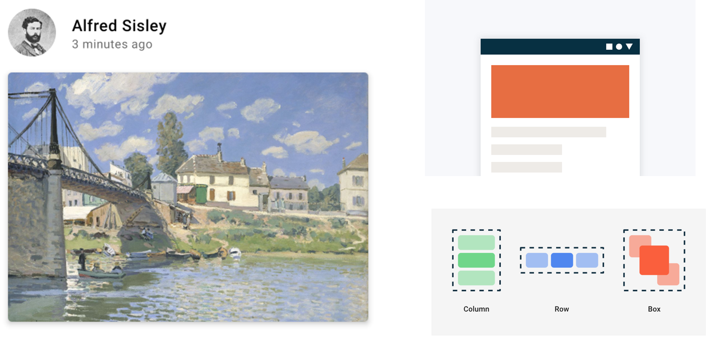
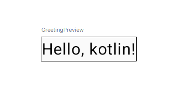
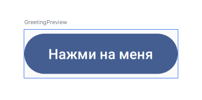
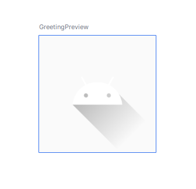
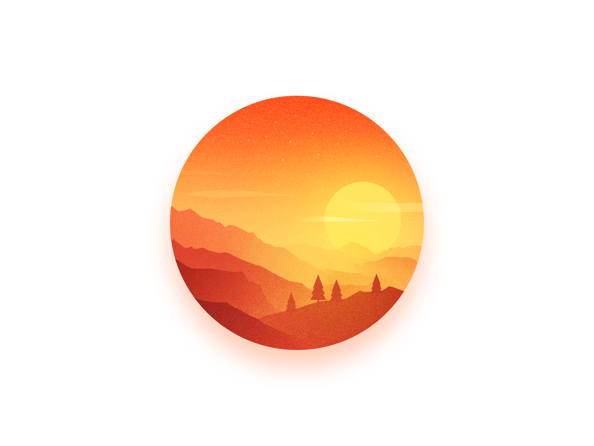
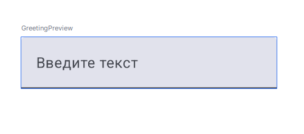
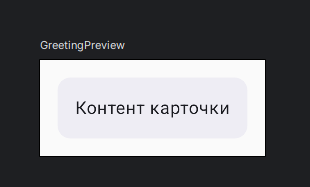
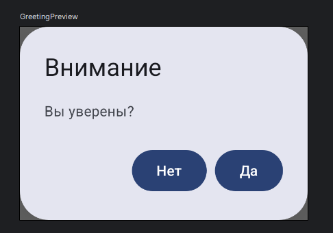

# Jetpack compose

* **Аналогия:** Создание интерфейса в Compose похоже на создание конструктора из блоков LEGO — можно собирать и разбирать элементы по желанию. 🧱➡️🏰
* **Преимущества:**
  * Быстрый предварительный просмотр 👀.
  * Меньше кода, больше функциональности 📝➡️⚙️.

## 1. Компоненты

Все UI-элементы создаются через функции, помеченные аннотацией @Composable.

````kotlin
@Composable
fun Greeting(name: String) {
    Text(text = "Hello, $name!")
}
````

## 2. Основные элементы UI

##### **Таблица основных компонентов:**

|Компонент|Описание||
|---------|--------|-|
|Scaffold|Структура экрана|🗺️|
|CenterAlignedTopAppBar|Верхняя панель с центровкой|📌|
|Text|Текстовый элемент|📝|
|Button|Кнопка действия|🖲️|
|OutlinedButton|Кнопка с обводкой|🖲️🔲|
|Column|Вертикальное расположение|⬇️|
|Spacer|Отступ между элементами|↔️|
|Row|Горизонтальное расположение|➡️|
|Box|Наложение элементов|📦|
|LazyColumn|Прокручиваемый список|📜|
|Surface|Контейнер с настройками|🎨|

### 📝Text - Текстовый блок.



* **`Text()`:** Отображение текста.

````kotlin
Text(
    text = "Welcome to Jetpack Compose!",
    color = Color.Blue,
    fontSize = 18.sp,
    fontWeight = FontWeight.Bold
    )
````

* ==text== - заданный текст
* ==color==- цвет текста
* ==fontSize== - размер текста
* ==fontWeight== - жирность или вес текста

## 🖲️ Button - Кнопка.

* **`Button()`:** Кнопка действия.



````kotlin
Button(onClick = { /* Событие нажатия */ }) {
    Text("Нажми на меня")
}
````

## Image




````kotlin
Image(
            painter = painterResource(id = R.drawable.ic_launcher_foreground),
            contentDescription = "Example image",
            modifier = Modifier.size(100.dp)
        )
````

## TextField



````kotlin
 var text by remember { mutableStateOf("") }
        TextField(
            value = text,
            onValueChange = { text = it },
            label = { Text("Введите текст") }
        )

````

## Карточка



````kotlin
Card(
    modifier = Modifier.padding(16.dp),
    colors = CardDefaults.cardColors(
        containerColor = MaterialTheme.colorScheme.surfaceContainer
    )
) {
    Text("Контент карточки", modifier = Modifier.padding(16.dp))
}

````

## Диалоговое окно



````kotlin
AlertDialog(
    onDismissRequest = { /* Закрытие диалога */ },
    title = { Text("Внимание") },
    text = { Text("Вы уверены?") },
    confirmButton = { Button(onClick = {}) { Text("Да") } },
    dismissButton = { Button(onClick = {}) { Text("Нет") } }
)

````

## 📊 Управление состоянием

````kotlin
@Composable
fun StateExample() {
    // Локальное состояние
    var count by remember { mutableStateOf(0) }
    
    Column(
        modifier = Modifier.padding(16.dp),
        verticalArrangement = Arrangement.spacedBy(8.dp)
    ) {
        Text("Счетчик: $count")
        Button(onClick = { count++ }) {
            Text("Увеличить")
        }
    }
}
````

### Типы состояний:

* `remember` - сохраняет состояние при перекомпозиции
* `rememberSaveable` - сохраняет состояние при повороте экрана
* `collectAsState()` - для работы с Flow
* `LiveData.observeAsState()` - для работы с LiveData

## 📚 Полезные ресурсы

* [Библиотека «Jetpack Compose» для начинающего Android-разработчика](https://habr.com/ru/articles/757572/)
* ````
  [Создание компонентов Composable](https://metanit.com/kotlin/jetpack/1.5.php)
  ````
  
  * [Руководство по составлению Jetpack](https://developer.android.com/develop/ui/compose/tutorial?hl=ru)
  * 

## 🎥 Видео материалы

[](https://www.youtube.com/watch?v=taWNluAoyaE&pp=ygUhamV0cGFjayBjb21wb3NlIE1hdGVyaWFsIERlc2lnbiAz)

[](https://youtu.be/YEcVkUN6caw?list=PLIh9yLdjK2YeRLnD-gJyVWIq_w-7OMv8r)
[](https://youtu.be/7Xg1HSox8QI?list=PLXtiZNKIobF5E1JgDaisqnVJfbZeUFYkm)

# Android - View в Android

* **Jetpack Compose:**
* 

[](https://youtu.be/6iVK-DRp61c?list=PLIh9yLdjK2YeRLnD-gJyVWIq_w-7OMv8r)

[](https://youtu.be/RKMx8aj-q7Y?list=PLXtiZNKIobF5E1JgDaisqnVJfbZeUFYkm)
