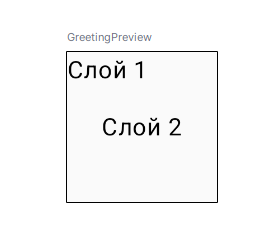
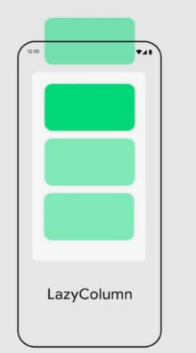
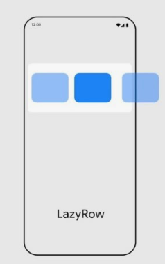
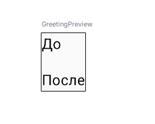
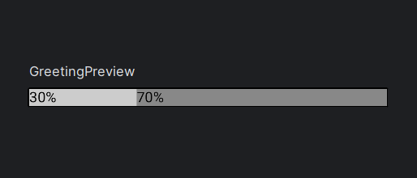
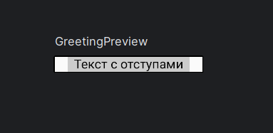
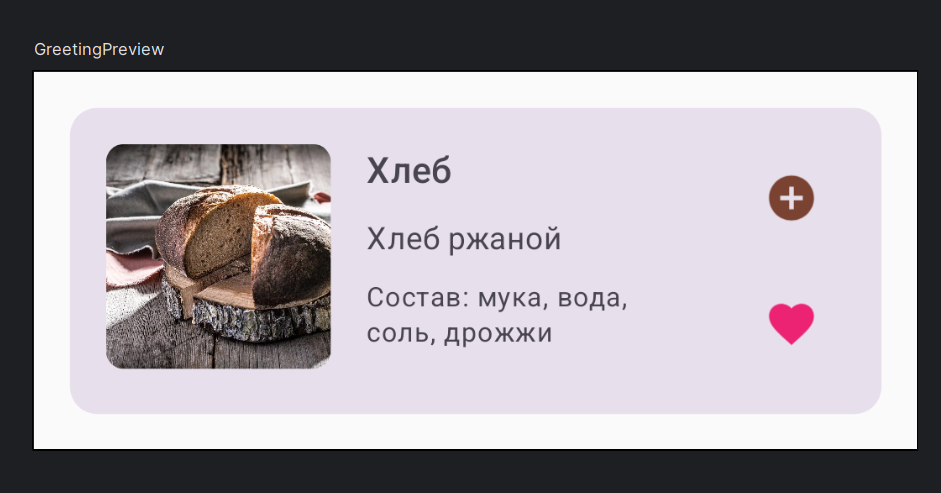

* Compose предоставляет мощные инструменты для верстки, позволяя компоновать элементы вертикально, горизонтально или накладывать их друг на друга.

## Column Колонка (вертикальная группа элементов ):

**Column (колонка) – Composable функция для вертикального размещения элементов друг под другом.** Как будто вы ставите коробки одна на другую


**Элементы размещаются друг под другом.**

**Свойства**:

* verticalArrangement — управление расстоянием между элементами (например, SpaceAround, Top).
* horizontalAlignment — выравнивание по горизонтали (например, CenterHorizontally, Start).


````kotlin
Column {
    Text("Элемент 1")
    Text("Элемент 2")
}

````

## Row Ряд (горизонтальная группа):


- **Row (строка) – Composable функция для горизонтального размещения элементов в ряд.** Как будто вы ставите коробки в ряд на полке. **Элементы размещаются в строку.**

**Свойства:**

* horizontalArrangement — управление расстоянием между элементами (например, SpaceEvenly, Start).
* verticalAlignment — выравнивание по вертикали (например, CenterVertically, Top).

````kotlin
Row {
    Text("Слева")
    Spacer(modifier = Modifier.width(8.dp))
    Text("Справа")
}


````


- **Модификации для Column и Row:** Можно применять модификаторы и к Column и Row тоже, например, **.padding** для общего отступа вокруг колонки/строки, **.background** для фона, **.fillMaxSize()** для размера.
    
- **horizontalAlignment и verticalArrangement для Column (и verticalAlignment и horizontalArrangement для Row) – для выравнивания элементов внутри Column/Row.**

```kotlin
Column(
    modifier = Modifier.fillMaxSize(),
    horizontalAlignment = Alignment.CenterHorizontally, // Выравнивание по центру по горизонтали
    verticalArrangement = Arrangement.Center // Выравнивание по центру по вертикали
) {
    Text(text = "Текст по центру!")
}
```

- **Alignment.CenterHorizontally, Alignment.Start, Alignment.End** - варианты горизонтального выравнивания.
    
- **Arrangement.Center, Arrangement.Top, Arrangement.Bottom, Arrangement.SpaceAround, Arrangement.SpaceBetween, Arrangement.SpaceEvenly** - варианты вертикального (и горизонтального для Row) выравнивания и распределения места.
## Box коробка (накладывающиеся элементы):


 В **Box** элементы **позиционируются относительно друг друга или относительно границ самого Box** с помощью модификатора .align(Alignment.*).
**Элементы накладываются друг на друга располагаются один над другим (внахлест), как слои**. В отличие от Column и Row, которые располагают элементы последовательно.
В **Box** элементы не располагаются последовательно и могут перекрывать друг друга.

````kotlin
Box(modifier = Modifier.size(100.dp)) {
    Text("Слой 1", modifier = Modifier.align(Alignment.TopStart))
    Text("Слой 2", modifier = Modifier.align(Alignment.Center))
}

````

- **Элементы внутри Box располагаются в порядке их объявления в коде:** Первый элемент, объявленный в Box, отрисовываются "позади" (как нижний слой), второй - поверх него, и так далее.
    
- **Позиционирование элементов внутри Box осуществляется с помощью Modifier.align(Alignment.*):** Этот модификатор позволяет выровнять элемент относительно границ самого Box.
- 
**Свойства:**

* **contentAlignment** — задает выравнивание вложенных элементов. **Alignment.Center, Alignment.TopStart, Alignment.BottomEnd, Alignment.TopCenter** и другие варианты Alignment.* – для указания положения элемента внутри Box

**Различные варианты Alignment для Modifier.align(Alignment.*):**

- **Alignment.TopStart**: Верхний левый угол Box.
    
- **Alignment.TopCenter**: Верхний центр Box.
    
- **Alignment.TopEnd**: Верхний правый угол Box.
    
- **Alignment.CenterStart**: Вертикальный центр, левый край Box.
    
- **Alignment.Center**: Центр Box (и по горизонтали, и по вертикали).
    
- **Alignment.CenterEnd**: Вертикальный центр, правый край Box.
    
- **Alignment.BottomStart**: Нижний левый угол Box.
    
- **Alignment.BottomCenter**: Нижний центр Box.
    
- **Alignment.BottomEnd**: Нижний правый угол Box.


## LazyColumn (список)



- **LazyColumn** – **Composable** функция для создания **вертикальных прокручиваемых списков**. **"Lazy"** означает, что **элементы списка создаются только тогда, когда становятся видимыми на экране** (ленивая загрузка), что делает его эффективным для длинных списков (тысячи элементов). **Замена RecyclerView в старом XML View**.
- Используется для работы с длинными списками или динамическими данными.

**Свойства:**

* items() — генерирует элементы из списка или диапазона.
* verticalArrangement — расстояние между элементами.

````kotlin
@Composable
fun LazyColumnExample() {
    LazyColumn {
    items(count = 20) { index -> // items функция для создания элементов списка. count - количество элементов
        Text(text = "Элемент списка №${index + 1}", modifier = Modifier.padding(16.dp)) // Text для каждого элемента списка, с отступами
        Divider() // Разделитель между элементами
    }
}
}
````
- **LazyColumn { ... } – создаем LazyColumn. Внутри { ... } используем функцию items(count = 20) { index -> ... }.**
    
- items(count = 20) { index -> ... } – функция, которая создает **20 элементов списка**. count = 20 – указываем количество элементов. { index -> ... } – лямбда-выражение, которое **выполняется для каждого элемента списка**. index – индекс элемента (от 0 до 19).
    
- Text(text = "Элемент списка №${index + 1}", modifier = Modifier.padding(16.dp)) – создаем Text для каждого элемента списка, отображаем текст "Элемент списка №1", "Элемент списка №2" и т.д. с отступами.
    
- Divider() – добавляем разделительную линию после каждого элемента списка.
## LazyRow (горизонтальный список)



 **LazyRow** – Composable функция для создания **горизонтальных прокручиваемых списков**.
**Свойства:**
**LazyRow** – аналогична **LazyColumn**, но для **горизонтального** списка. Используется, например, для создания горизонтальной ленты элементов.

* items() — генерирует элементы из списка или диапазона.
* horizontalArrangement — расстояние между элементами.

````kotlin
@Composable
fun LazyRowExample() {
    LazyRow(
        modifier = Modifier.fillMaxWidth(),
        horizontalArrangement = Arrangement.spacedBy(8.dp)
    ) {
        items(50) { index ->
            Text("Item $index", modifier = Modifier.padding(8.dp))
        }
    }
}
````

## Spacer (разделитель пространства)



````kotlin
@Composable
fun SpacerExample() {
    Column {
        Text("До")
        Spacer(modifier = Modifier.height(16.dp))
        Text("После")
    }
}
````

## ConstraintLayout (сложная компоновка)

**Для более сложных схем.**


````kotlin
@Composable
fun ConstraintLayoutExample() {
    ConstraintLayout(
        modifier = Modifier.fillMaxSize()
    ) {
        val (text1, text2, button) = createRefs()

        Text(
            "Hello",
            modifier = Modifier.constrainAs(text1) {
                top.linkTo(parent.top)
                start.linkTo(parent.start)
            }
        )
        Text(
            "World",
            modifier = Modifier.constrainAs(text2) {
                top.linkTo(text1.bottom)
                start.linkTo(text1.end)
            }
        )
        Button(
            onClick = { },
            modifier = Modifier.constrainAs(button) {
                bottom.linkTo(parent.bottom)
                end.linkTo(parent.end)
            }
        ) {
            Text("Click me")
        }
    }
}
````

## 🎯 Модификаторы расположения

### Weight (вес)

Позволяет распределить доступное пространство пропорционально:


````kotlin
Row(modifier = Modifier.fillMaxWidth()) {
    Text(
        "30%",
        modifier = Modifier
            .weight(0.3f)
            .background(Color.LightGray)
    )
    Text(
        "70%",
        modifier = Modifier
            .weight(0.7f)
            .background(Color.Gray)
    )
}
````



### Padding и Margin

````kotlin
@Composable  
fun PaddingExample() {  
    Box(  
        modifier = Modifier  
            .padding(horizontal = 16.dp) // отступы снаружи  
            .background(Color.LightGray)  
            .padding(horizontal = 8.dp)  // отступы внутри  
    ) {  
        Text("Текст с отступами")  
    }  
}
````

## 🔄 Адаптивная верстка

### Responsive Layout

Адаптация под разные размеры экрана:

````kotlin
@Composable
fun ResponsiveLayout() {
    BoxWithConstraints {
        when {
            maxWidth < 600.dp -> NarrowLayout() // Если ширина меньше 600 используем узкий вариант NarrowLayout
            else -> WideLayout() // Иначе широкий вариант  WideLayout
        }
    }
}
````

## 📱 Практические примеры



### Карточка продукта

``