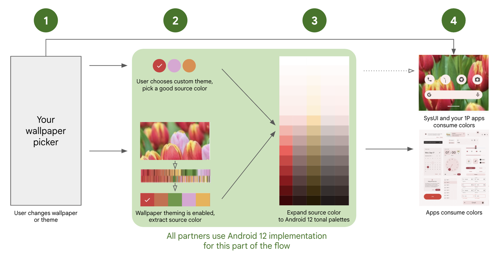
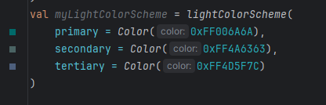
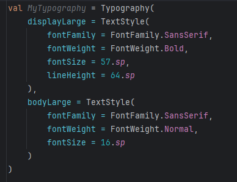
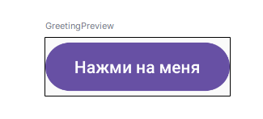
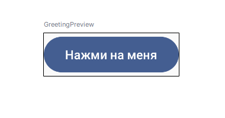
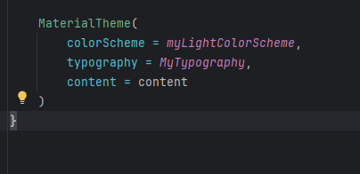
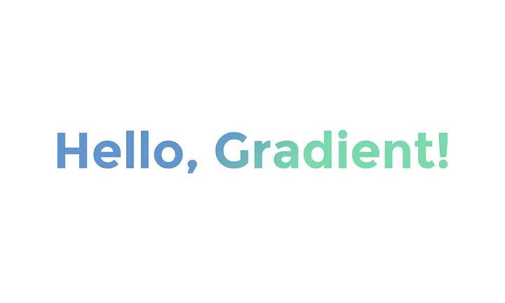

## 📱 Введение

**Зачем нужны темы и стили?** 

*   **Единообразие:** Темы и стили помогают поддерживать единообразный внешний вид приложения.
*   **Повторное использование:**  Определив стиль один раз, вы можете использовать его во всем приложении.
*   **Легкое изменение внешнего вида:**  Изменив тему, вы можете изменить внешний вид всего приложения.
*   **Поддержка разных тем:**  Поддержка светлой и темной тем, а также динамических цветов (Material You).
*   **Адаптивность:**  Приложение может адаптироваться к настройкам системы (например, к размеру шрифта).


**Material Design 3** - это последняя версия дизайн-системы от Google, которая предлагает более гибкий и персонализированный подход к дизайну приложений.

Основные особенности Material 3:

*   **Динамические цвета:**  Цветовая схема приложения может адаптироваться к обоям пользователя.
*   **Новые компоненты:**  Новые версии существующих компонентов и новые компоненты (например, `ExtendedFloatingActionButton`).
*   **Обновленная типографика:**  Новые шрифты и стили текста.
*   **Улучшенная поддержка темной темы.**

## 🎯 Ключевые особенности MD3

**Структура темы в Compose** 

Тема в Compose обычно состоит из:

*   **`ColorScheme`:**  Набор цветов (primary, secondary, background, surface, error и т.д.).
*   **`Typography`:**  Набор стилей текста (h1, h2, body1, button и т.д.).
*   **`Shapes`:**  Набор форм (для кнопок, карточек, диалоговых окон и т.д.).
### 1. Динамические цвета

* Автоматическая адаптация под обои устройства
* Гармоничная цветовая схема
* Поддержка светлой и тёмной темы

### 2. Улучшенные компоненты

* NavigationBar с анимациями
* Современный SearchBar
* Обновлённые Date/Time Pickers
* Адаптивные диалоги и меню

### 3. Типография

* Обновлённая система шрифтов
* Улучшенная читаемость
* Адаптивные размеры

## 🛠 Настройка проекта

### Базовая тема

````kotlin
@Composable
fun MyAppTheme(
    darkTheme: Boolean = isSystemInDarkTheme(),
    dynamicColor: Boolean = true,
    content: @Composable () -> Unit
) {
    val colorScheme = when {
        dynamicColor && Build.VERSION.SDK_INT >= Build.VERSION_CODES.S -> {
            val context = LocalContext.current
            if (darkTheme) dynamicDarkColorScheme(context) 
            else dynamicLightColorScheme(context)
        }
        darkTheme -> darkColorScheme()
        else -> lightColorScheme()
    }

    MaterialTheme(
        colorScheme = colorScheme,
        typography = MyTypography,
        shapes = Shapes,
        content = content
    )
}
````

**Material Design3 по умолчанию использует динамическую тему оформления основанную на примененной теме оформления телефона с учетом выбранного режима отображения день или ночь, это и называется динамический цвета.**

**Использование `MaterialTheme`:**

````kotlin
@Composable
    fun MyApplicationTheme(content: @Composable () -> Unit) {
        MaterialTheme(
            colorScheme = lightColorScheme(), // или darkColorScheme()
            typography = Typography,
            content = content
        )
    }
````

## 🎎 Пользовательские цветовые схемы, темы и стили

Создание своих Composable-функций позволяет повторно использовать элементы интерфейса и упрощать код дополняя визуальными представлениями.

### Стандартные цвета MD3

````kotlin
val DefaultLightColorScheme = lightColorScheme(
    primary = md_theme_light_primary,
    onPrimary = md_theme_light_onPrimary,
    primaryContainer = md_theme_light_primaryContainer,
    secondary = md_theme_light_secondary,
    // ... другие цвета
)
````

### Пользовательская цветовая схема



**Создание своей палитры:**

````kotlin
val CustomLightColorScheme = lightColorScheme(
    primary = Color(0xFF006A6A),
    secondary = Color(0xFF4A6363),
    tertiary = Color(0xFF4D5F7C),
    surface = Color(0xFFFAFDFD),
    onSurface = Color(0xFF191C1C)
)
````

## ✏️ Типография

### Настройка собственных шрифтов



````kotlin
val MyTypography = Typography(
    displayLarge = TextStyle(
        fontFamily = FontFamily.SansSerif,
        fontWeight = FontWeight.Bold,
        fontSize = 57.sp,
        lineHeight = 64.sp
    ),
    bodyLarge = TextStyle(
        fontFamily = FontFamily.SansSerif,
        fontWeight = FontWeight.Normal,
        fontSize = 16.sp,
        lineHeight = 24.sp
    ),
    // ... другие стили
)
````

### Темы:

````kotlin
MyApplicationTheme {
    Greeting("Compose") //MyApplicationTheme название нашей темы
}
````

==MyApplicationTheme== в нашем случае название темы, зависит от названия нашего приложения или используемой кастомной темы или функции изменения внешнего вида.

Применение темы нашего приложения, для применения оформления темы оборачиваем элементы темой:

## Без темы



## С темой



````kotlin
ExampleAppTheme {
    Button(onClick = { /* Событие нажатия */ }) {
    Text("Нажми на меня")
}
}

````


Стандартная тема оформления.


**Цветовые схемы**:


После применения созданной нами темы с измененными цветами и шрифтами

## 🔷 Формы и компоненты

### 

Настройка форм

````kotlin
val Shapes = Shapes(
    extraSmall = RoundedCornerShape(4.dp),
    small = RoundedCornerShape(8.dp),
    medium = RoundedCornerShape(16.dp),
    large = RoundedCornerShape(24.dp),
    extraLarge = RoundedCornerShape(32.dp)
)
````

### Градиентные компоненты



## Пример: Пользовательский текст с градиентом

````kotlin

@Composable
fun GradientText(text: String, gradient: Brush) {
    Text(
        text = text,
        style = TextStyle(
            brush = gradient,
            fontSize = 24.sp,
            fontWeight = FontWeight.Bold
        )
    )
}

val gradient = Brush.linearGradient(
    colors = listOf(Color.Blue, Color.Green)
)

GradientText(text = "Hello Gradient", gradient = gradient)

````

## 📱 Практические примеры


**Создание собственной темы** 

**Шаг 1: Определите цвета (`colors.kt` или `Color.kt`):**

```kotlin
// ui/theme/Color.kt
import androidx.compose.ui.graphics.Color

val Purple80 = Color(0xFFD0BCFF)
val PurpleGrey80 = Color(0xFFCCC2DC)
val Pink80 = Color(0xFFEFB8C8)

val Purple40 = Color(0xFF6650a4)
val PurpleGrey40 = Color(0xFF625b71)
val Pink40 = Color(0xFF7D5260)

//Свои цвета
val LightBlue = Color(0xFFADD8E6)
val DarkBlue = Color(0xFF00008B)

```
В этом файле мы определяем константы для цветов, которые будем использовать.

**Шаг 2: Определите типографику (`Type.kt`):**

```kotlin
// ui/theme/Type.kt
import androidx.compose.material3.Typography
import androidx.compose.ui.text.TextStyle
import androidx.compose.ui.text.font.FontFamily
import androidx.compose.ui.text.font.FontWeight
import androidx.compose.ui.unit.sp

// Set of Material typography styles to start with
val Typography = Typography(
    bodyLarge = TextStyle(
        fontFamily = FontFamily.Default,
        fontWeight = FontWeight.Normal,
        fontSize = 16.sp,
        lineHeight = 24.sp,
        letterSpacing = 0.5.sp
    )
    /* Other default text styles to override
    titleLarge = TextStyle(
        fontFamily = FontFamily.Default,
        fontWeight = FontWeight.Normal,
        fontSize = 22.sp,
        lineHeight = 28.sp,
        letterSpacing = 0.sp
    ),
    labelSmall = TextStyle(
        fontFamily = FontFamily.Default,
        fontWeight = FontWeight.Medium,
        fontSize = 11.sp,
        lineHeight = 16.sp,
        letterSpacing = 0.5.sp
    )
    */
)
```
Здесь определяются стили текста.

**Шаг 3: Определите формы (`Shape.kt`):**
```kotlin
//ui/theme/Shape.kt
import androidx.compose.foundation.shape.RoundedCornerShape
import androidx.compose.material3.Shapes
import androidx.compose.ui.unit.dp

val Shapes = Shapes(
    small = RoundedCornerShape(4.dp),
    medium = RoundedCornerShape(4.dp),
    large = RoundedCornerShape(0.dp)
)
```
Тут настраиваются скругления для кнопок, карточек и тд.

**Шаг 4 Измените файл `Theme.kt`:****

```kotlin
// ui/theme/Theme.kt
import android.app.Activity
import android.os.Build
import androidx.compose.foundation.isSystemInDarkTheme
import androidx.compose.material3.*
import androidx.compose.runtime.Composable
import androidx.compose.runtime.SideEffect
import androidx.compose.ui.graphics.Color
import androidx.compose.ui.graphics.toArgb
import androidx.compose.ui.platform.LocalContext
import androidx.compose.ui.platform.LocalView
import androidx.core.view.WindowCompat

private val DarkColorScheme = darkColorScheme(
    primary = Purple80,
    secondary = PurpleGrey80,
    tertiary = Pink80,
    background = Color(0xFF1C1B1F), // Темный фон
    surface = Color(0xFF1C1B1F), // Темный фон для поверхностей (карточки и т.д.)
    onPrimary = Color.White, // Цвет текста на primary цвете
    onSecondary = Color.White,
    onTertiary = Color.White,
    onBackground = Color.White, // Цвет текста на фоне
    onSurface = Color.White, // Цвет текста на поверхности
)

private val LightColorScheme = lightColorScheme(
    primary = Purple40,
    secondary = PurpleGrey40,
    tertiary = Pink40,
    background = Color(0xFFFFFBFE),
    surface = Color(0xFFFFFBFE),
    onPrimary = Color.White,
    onSecondary = Color.White,
    onTertiary = Color.White,
    onBackground = Color(0xFF1C1B1F),
    onSurface = Color(0xFF1C1B1F),

    /* Other default colors to override
    background = Color(0xFFFFFBFE),
    surface = Color(0xFFFFFBFE),
    onPrimary = Color.White,
    onSecondary = Color.White,
    onTertiary = Color.White,
    onBackground = Color(0xFF1C1B1F),
    onSurface = Color(0xFF1C1B1F),
    */
)

@Composable
fun MyApplicationTheme(
    darkTheme: Boolean = isSystemInDarkTheme(),
    // Dynamic color is available on Android 12+
    dynamicColor: Boolean = true,
    content: @Composable () -> Unit
) {
    val colorScheme = when {
        dynamicColor && Build.VERSION.SDK_INT >= Build.VERSION_CODES.S -> {
            val context = LocalContext.current
            if (darkTheme) dynamicDarkColorScheme(context) else dynamicLightColorScheme(context)
        }
        darkTheme -> DarkColorScheme
        else -> LightColorScheme
    }
    val view = LocalView.current
    if (!view.isInEditMode) {
        SideEffect {
          //Для status bar
            val window = (view.context as Activity).window
            window.statusBarColor = colorScheme.primary.toArgb()
            WindowCompat.getInsetsController(window, view).isAppearanceLightStatusBars = darkTheme
        }
    }

    MaterialTheme(
        colorScheme = colorScheme,
        typography = Typography,
        content = content,
        shapes = Shapes //Добавляем
    )
}
```

*   **`DarkColorScheme` and `LightColorScheme`:**  Определяем цветовые схемы для темной и светлой тем.
*   **`MyApplicationTheme(...)`:**  Composable-функция, которая предоставляет тему для приложения.
    *   **`darkTheme: Boolean = isSystemInDarkTheme()`:**  Определяет, использовать ли темную тему (по умолчанию – в зависимости от настроек системы).
    *   **`dynamicColor: Boolean = true`:**  Включает/выключает использование динамических цветов (Material You).
    *   **`content: @Composable () -> Unit`:**  Composable-функция, которая представляет собой содержимое приложения.
    *   **`when { ... }`:**  Выбираем цветовую схему в зависимости от настроек.
        *   Если `dynamicColor` включен и версия Android >= S (12), используем динамические цвета (`dynamicDarkColorScheme` или `dynamicLightColorScheme`).
        *   Иначе используем статическую цветовую схему (`DarkColorScheme` или `LightColorScheme`).
* **`SideEffect`**: Используется, чтобы применить изменения к статус бару.


**Шаг 5 Использование темы`:

```kotlin
// MainActivity.kt
import ...
import com.example.myapplication.ui.theme.MyApplicationTheme // Импортируем вашу тему

@AndroidEntryPoint
class MainActivity : ComponentActivity() {
    override fun onCreate(savedInstanceState: Bundle?) {
        super.onCreate(savedInstanceState)
        setContent {
            MyApplicationTheme { // Оборачиваем все содержимое в MyApplicationTheme
                // ... остальной код вашего приложения ...
                Surface(modifier = Modifier.fillMaxSize(), color = MaterialTheme.colorScheme.background){
                  //...
                }
            }
        }
    }
}

// Пример использования цветов из темы
@Composable
fun MyComponent() {
    Text(
        text = "Hello",
        color = MaterialTheme.colorScheme.primary, // Используем цвет primary из темы
        style = MaterialTheme.typography.bodyLarge // Используем стиль текста bodyLarge из темы
    )
    Button(
       onClick = {},
       shape = MaterialTheme.shapes.medium
    ){
      Text(text = "Кнопка")
    }
}
```

*   Оборачиваем все содержимое приложения в `MyApplicationTheme`.
*   Используем цвета, стили текста и формы из темы с помощью `MaterialTheme.colorScheme`, `MaterialTheme.typography` и `MaterialTheme.shapes`.
### Карточка в стиле MaterialDesign3


````kotlin
@Composable
fun MD3Card(
    title: String,
    content: String
) {
    ElevatedCard(
        modifier = Modifier
            .fillMaxWidth()
            .padding(16.dp),
        colors = CardDefaults.elevatedCardColors(
            containerColor = MaterialTheme.colorScheme.surfaceVariant
        )
    ) {
        Column(
            modifier = Modifier.padding(16.dp)
        ) {
            Text(
                text = title,
                style = MaterialTheme.typography.titleLarge
            )
            Spacer(modifier = Modifier.height(8.dp))
            Text(
                text = content,
                style = MaterialTheme.typography.bodyMedium
            )
        }
    }
}
````

## ✅ Чек-лист внедрения MD3

* [ ] Настроены цветовые схемы
* [ ] Определена типография
* [ ] Настроены формы компонентов

## 📚 Полезные ресурсы

* [Material Design 3 Guidelines](https://m3.material.io/)
* [Compose Material 3 Components](https://developer.android.com/reference/kotlin/androidx/compose/material3/package-summary)
* [Material Theme Builder](https://material-foundation.github.io/material-theme-builder/)
* [Material Design Tokens](https://m3.material.io/foundations/design-tokens/overview)

## 🎥 Видео материалы

[](https://www.youtube.com/watch?v=9b1WIysoTHQ&list=PL1b73-6UjePAGw5BsVvHzPXTHTWhh6cXi)
\[](https://www.youtube.com/watch?v=h_JYW2hdI8U&list=PLSrm9z4zp4mHuMzmjZQyGYeWRF-LZwk1H)

[](https://www.youtube.com/watch?v=2xpsWfGk7vA&list=PLDaL-rEXYvLsoKLni3mZqi2OBP2kA7LiT)
