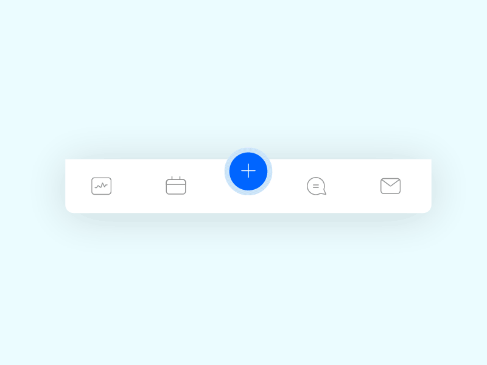

# 🧭 Навигация и меню в Jetpack Compose

## 📱 Введение


Навигация - важнейший компонент любого Android-приложения. Jetpack Compose предоставляет мощный инструментарий для создания навигации и различных типов меню.

## 🎓 Теория

## 🗺️ Основы навигации

**Навигация в Compose построена на основных концепциях:**

- **NavHostController** - "Контроллер навигации", управляет стеком экранов и навигацией между ними.
    
- **NavHost** - Composable Function - "Контейнер навигации", отображает текущий экран навигации и управляет переключением между экранами.
    
- **composable("route") { ... }** - Функция для определения **отдельного экрана (Composable Function)** в графе навигации, и привязки его к **"route" (маршруту) - уникальному строковому идентификатору экрана**.
    
- **NavController.navigate("route")** - Функция для выполнения **навигации на экран по его "route"**.

**Важные концепции:**

* **Route** — строковый идентификатор экрана
* **Arguments** — параметры, передаваемые между экранами
* **Back Stack** — стек экранов для навигации назад

**Типы переходов:**

* **Push** — добавление экрана поверх текущего
* **Pop** — возврат к предыдущему экрану
* **PopUpTo** — возврат к определенному экрану
* **Single Top** — предотвращение дубликатов экрана

### NavController

**Основной элемент навигации, который:**

* Отслеживает стек навигации
* Управляет переходами между экранами
* Хранит состояние навигации

Чтобы перейти на другой экран, используйте методы `NavController`:

*   **`navigate(route: String)`:**  Переходит на экран, соответствующий указанному `route`.

**Свойства:**

* currentBackStackEntryAsState — текущий экран
* previousBackStackEntry — предыдущий экран
* graph — граф навигации

````kotlin
import androidx.compose.material3.Button
import androidx.compose.material3.Text
import androidx.compose.runtime.Composable
import androidx.navigation.NavController

@Composable
fun HomeScreen(navController: NavController, userId: Int) {
    Button(onClick = {
      navController.navigate("details/123?itemName=ExampleItem")
    }) {
        Text("Go to Details")
    }
    Text("User ID: $userId")
````
В `HomeScreen` при нажатии на кнопку мы вызываем `navController.navigate("details/123?itemName=ExampleItem")`.
`"details/{itemId}?itemName={itemName}"` - это шаблон маршрута. `itemId` обязательный, `itemName` необязательный, передается через query-параметр.
Composable-функции экранов (HomeScreen, DetailsScreen)**

```kotlin

import androidx.compose.foundation.layout.Column
import androidx.compose.material3.Text
import androidx.compose.runtime.Composable
import androidx.navigation.NavController

@Composable
fun HomeScreen(navController: NavController, userId: Int) {
  Column() {
    Text(text = "Home Screen")
    Text(text = "User ID: $userId")
    Button(onClick = {
      navController.navigate("details/123?itemName=ExampleItem")
    }) {
      Text("Go to Details")
    }
  }
}

@Composable
fun DetailsScreen(navController: NavController, itemId: Int?, itemName: String?) {
  Column() {
    Text(text = "Details Screen")
    Text(text = "Item ID: $itemId")
    Text(text = "Item Name: $itemName")
    Button(onClick = { navController.popBackStack() }) { // Возврат на предыдущий экран
      Text(text = "Back")
    }
  }
}
```

*   **`HomeScreen`:**  Отображает текст "Home Screen" и кнопку "Go to Details". Принимает `userId`.
*   **`DetailsScreen`:**  Отображает текст "Details Screen", `itemId` и `itemName`.
    *  **`navController.popBackStack()`:** Возвращаемся на предыдущий экран в стеке.
### NavHost

**Контейнер, который отображает текущий экран на основе NavController.**

**Свойства:**

* navController — контроллер навигации
* startDestination — начальный экран
* route — путь навигации
* builder — построитель графа навигации

````kotlin
NavHost(
    navController = navController,
    startDestination = "home"
) {
    // Определение экранов
}
````

### BottomNavigation

Bottom Navigation – это панель в нижней части экрана, которая позволяет переключаться между основными разделами приложения.

**Свойства:**

* backgroundColor — цвет фона
* contentColor — цвет контента
* elevation — высота тени

````kotlin
NavigationBar {
    NavigationBarItem(
        selected = isSelected,
        onClick = { /* действие */ },
        icon = { Icon(...) },
        label = { Text(...) }
    )
}
````

```kotlin
import androidx.compose.foundation.layout.padding
import androidx.compose.material.icons.Icons
import androidx.compose.material.icons.filled.Home
import androidx.compose.material.icons.filled.Person
import androidx.compose.material.icons.filled.Settings
import androidx.compose.material3.*
import androidx.compose.runtime.*
import androidx.compose.ui.Modifier
import androidx.navigation.NavController
import androidx.navigation.NavDestination.Companion.hierarchy
import androidx.navigation.NavGraph.Companion.findStartDestination
import androidx.navigation.compose.NavHost
import androidx.navigation.compose.composable
import androidx.navigation.compose.currentBackStackEntryAsState
import androidx.navigation.compose.rememberNavController
import com.example.myapplication.ui.theme.MyApplicationTheme

// Определяем элементы Bottom Navigation
sealed class BottomNavItem(val route: String, val icon: ImageVector, val title: String) {
    object Home : BottomNavItem("home", Icons.Filled.Home, "Home")
    object Profile : BottomNavItem("profile", Icons.Filled.Person, "Profile")
    object Settings : BottomNavItem("settings", Icons.Filled.Settings, "Settings")
}

@Composable
fun BottomNavApp() {
    val navController = rememberNavController()
    MyApplicationTheme {
        Scaffold(
            bottomBar = { BottomNavigationBar(navController) }
        ) { innerPadding ->
            NavHost(navController, startDestination = BottomNavItem.Home.route, Modifier.padding(innerPadding)) {
                composable(BottomNavItem.Home.route) { HomeScreen(navController) }
                composable(BottomNavItem.Profile.route) { ProfileScreen(navController) }
                composable(BottomNavItem.Settings.route) { SettingsScreen(navController) }
            }
        }
    }
}

@Composable
fun BottomNavigationBar(navController: NavController) {
    val items = listOf(
        BottomNavItem.Home,
        BottomNavItem.Profile,
        BottomNavItem.Settings
    )
    NavigationBar {
        val navBackStackEntry by navController.currentBackStackEntryAsState()
        val currentDestination = navBackStackEntry?.destination
        items.forEach { item ->
            NavigationBarItem(
                icon = { Icon(item.icon, contentDescription = item.title) },
                label = { Text(item.title) },
                selected = currentDestination?.hierarchy?.any { it.route == item.route } == true,
                onClick = {
                    navController.navigate(item.route) {
                        popUpTo(navController.graph.findStartDestination().id) {
                            saveState = true
                        }
                        launchSingleTop = true
                        restoreState = true
                    }
                }
            )
        }
    }
}


// Composable-функции для экранов (заглушки)
@Composable
fun HomeScreen(navController: NavController) {
    Text("Home Screen")
}

@Composable
fun ProfileScreen(navController: NavController) {
    Text("Profile Screen")
}

@Composable
fun SettingsScreen(navController: NavController) {
    Text("Settings Screen")
}

```

*   **`sealed class BottomNavItem(...)`:**  Определяем элементы Bottom Navigation (route, иконка, заголовок). `sealed class` – это класс, который может иметь ограниченное количество подклассов (в данном случае – `Home`, `Profile`, `Settings`).
*   **`BottomNavApp`:**  Основная функция, которая отображает `Scaffold` с `BottomNavigationBar` и `NavHost`.
    *   **`Scaffold`:**  Composable-функция, которая предоставляет базовый layout для Material Design приложений (с AppBar, BottomNavigationBar, Drawer и т.д.).
    *   **`bottomBar = { BottomNavigationBar(navController) }`:**  Устанавливаем Bottom Navigation Bar.
    *   **`NavHost(...)`:**  Определяем NavHost, как и раньше.
*   **`BottomNavigationBar`:**  Composable-функция, которая отображает Bottom Navigation Bar.
    *   **`items`:**  Список элементов Bottom Navigation.
    *   **`NavigationBar { ... }`:**  Composable-функция для создания Bottom Navigation Bar.
    *   **`navController.currentBackStackEntryAsState()`:**  Получаем текущее состояние стека переходов (back stack).
    *   **`currentDestination?.hierarchy?.any { it.route == item.route } == true`:**  Определяем, какой элемент Bottom Navigation должен быть выделен (selected).
    *   **`NavigationBarItem(...)`:**  Отображает один элемент Bottom Navigation.
        *   **`icon`:**  Иконка.
        *   **`label`:**  Заголовок.
        *   **`selected`:**  Выделен ли элемент.
        *   **`onClick`:**  Обработчик нажатия.
            *   **`navController.navigate(item.route) { ... }`:**  Переходим на соответствующий экран.
                *   **`popUpTo(navController.graph.findStartDestination().id) { saveState = true }`:**  Очищаем стек переходов до начального экрана, чтобы избежать накопления большого количества экранов в стеке.
                *   **`launchSingleTop = true`:**  Предотвращаем создание нескольких копий одного и того же экрана, если пользователь несколько раз нажимает на один и тот же элемент Bottom Navigation.
                *   **`restoreState = true`:**  Восстанавливаем состояние экрана (например, позицию прокрутки), если пользователь возвращается на него.
*  **`HomeScreen`, `ProfileScreen`, `SettingsScreen`:** Заглушки для будущих экранов.

### NavigationDrawer

Drawer Navigation – это боковое меню, которое выезжает слева (или справа) при нажатии на кнопку-"гамбургер" или при свайпе от края экрана. Реализуется с помощью `ModalNavigationDrawer`.
**Боковое меню.**

**Свойства:**

* drawerState — состояние меню (открыто/закрыто)
* drawerContent — содержимое меню
* gesturesEnabled — включение жестов
* scrimColor — цвет затемнения основного контента

````kotlin
ModalNavigationDrawer(
    drawerState = drawerState,
    drawerContent = { /* содержимое */ }
) {
    // Основной контент
}
````

### TopAppBar

**Верхняя панель приложения.**

**Свойства:**

* title — заголовок
* navigationIcon — иконка навигации (обычно меню или кнопка назад)
* actions — действия справа
* colors — цвета элементов

````kotlin
TopAppBar(
    title = { Text("Заголовок") },
    navigationIcon = { 
        IconButton(onClick = { /* действие */ }) {
            Icon(Icons.Default.Menu, null)
        }
    }
)
````

## 🚀 Навигация между экранами

### Типы навигации:

4. **Простая навигация**

````kotlin
navController.navigate("profile")
````

5. **Навигация с аргументами**

````kotlin
navController.navigate("details/123")
````

6. **Навигация с опциями**

````kotlin
navController.navigate("profile") {
    popUpTo("home") // Очистить стек до домашнего экрана
    launchSingleTop = true // Избежать дубликатов
    restoreState = true // Восстановить состояние
}
````

### Аргументы навигации:

**Типы аргументов:**

* StringType — строковые
* IntType — целочисленные
* BoolType — логические
* FloatType — числа с плавающей точкой

````kotlin
composable(
    "profile/{userId}",
    arguments = listOf(
        navArgument("userId") { 
            type = NavType.StringType 
            nullable = false
            defaultValue = "guest"
        }
    )
) { entry ->
    val userId = entry.arguments?.getString("userId")
    ProfileScreen(userId)
}
````

## 🛠 Настройка проекта

### Добавление зависимостей

````kotlin
dependencies {
   def nav_version = "2.8.6"

    implementation "androidx.navigation:navigation-compose:$nav_version"
    
    // Для анимаций навигации
    // https://mvnrepository.com/artifact/com.google.accompanist/accompanist-navigation-animation
runtimeOnly("com.google.accompanist:accompanist-navigation-animation:0.36.0")
}
````

## 📋 Типы меню

### 1. Bottom Navigation

**Нижняя панель навигации используется для:**

* Переключения между основными разделами
* Быстрого доступа к главным функциям
* Отображения текущего раздела

**Особенности:**

* Максимум 5 пунктов меню
* Всегда видимая панель
* Поддержка значков и подписей
* Индикация активного раздела

### 2. Drawer Navigation

**Боковое меню подходит для:**

* Большого количества разделов
* Редко используемых функций
* Дополнительных настроек

**Характеристики:**

* Скрыто по умолчанию
* Вызывается жестом или кнопкой
* Может содержать вложенные пункты
* Поддерживает заголовок и футер

### 3. Top App Bar

**Верхняя панель используется для:**

* Отображения заголовка экрана
* Быстрых действий
* Навигации назад
* Дополнительного меню

**Компоненты:**

* Заголовок
* Кнопка навигации (≡ или ←)
* Действия справа
* Выпадающее меню

## 🎨 Анимации навигации

**Типы анимаций:**

* **Fade** — плавное появление/исчезновение
* **Slide** — скольжение экранов
* **Scale** — масштабирование
* **Shared Element** — общие элементы

**Параметры анимаций:**

* **Duration** — длительность
* **Easing** — функция сглаживания
* **Direction** — направление
* **Offset** — смещение

**Состояния анимации:**

* **Enter** — появление экрана
* **Exit** — исчезновение экрана
* **PopEnter** — появление при возврате
* **PopExit** — исчезновение при возврате

## 📚 Полезные ресурсы

* [Navigation Compose](https://developer.android.com/jetpack/compose/navigation)
* [Material Design Navigation](https://m3.material.io/components/navigation-bar/overview)
* [Compose Animation](https://developer.android.com/jetpack/compose/animation)
* [Navigation Best Practices](https://developer.android.com/guide/navigation/navigation-principles)

## 🎥 Видео материалы

[](https://www.youtube.com/watch?v=wJKwsI5WUI4&pp=ygUaamV0cGFjayBjb21wb3NlIG5hdmlnYXRpb24%3D)

[](https://www.youtube.com/watch?v=glyqjzkc4fk&list=PLSrm9z4zp4mFYcmFGcJmdsps_lpsaWvKM)
