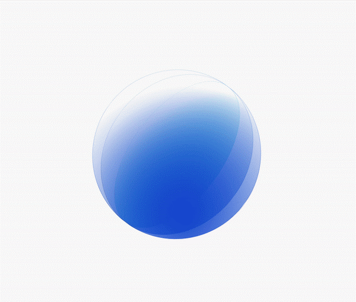
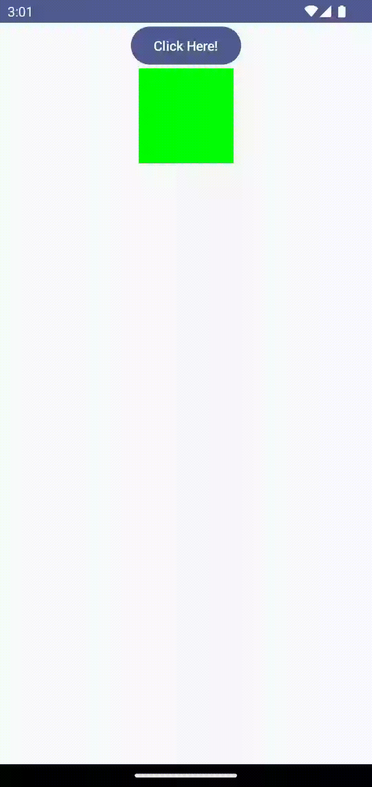
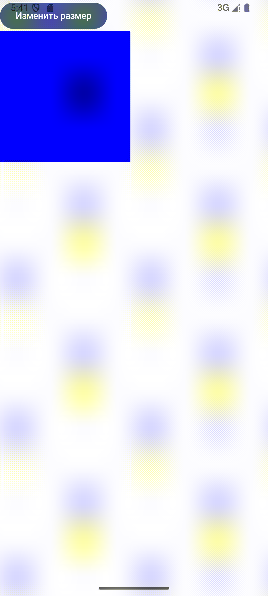
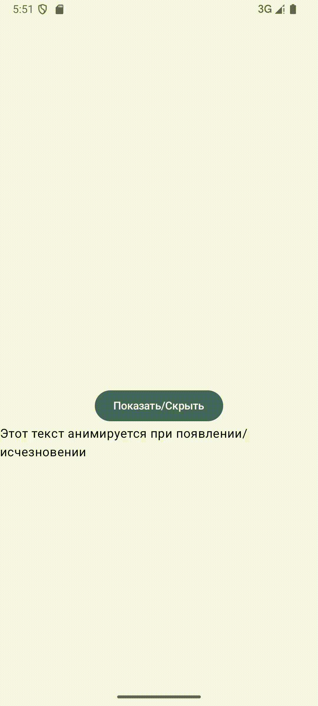
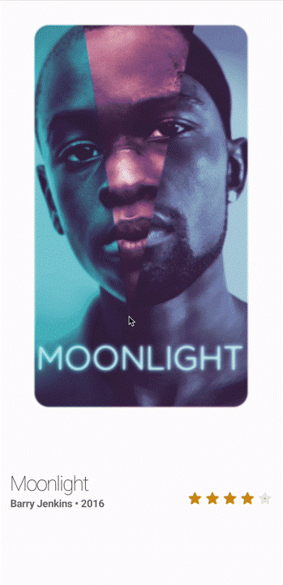
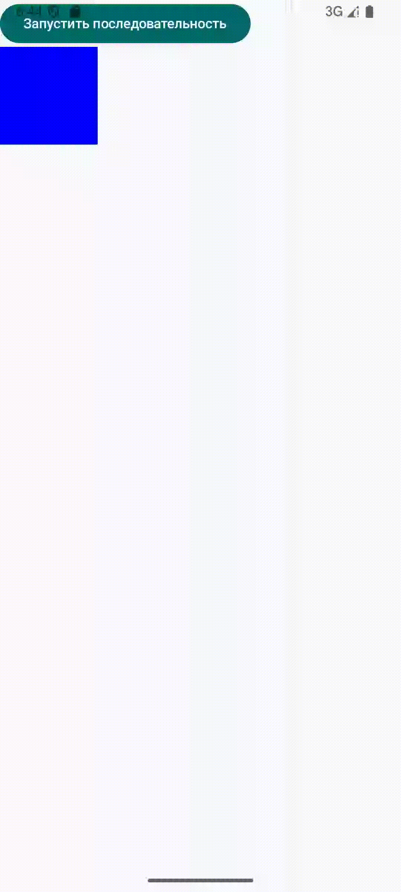
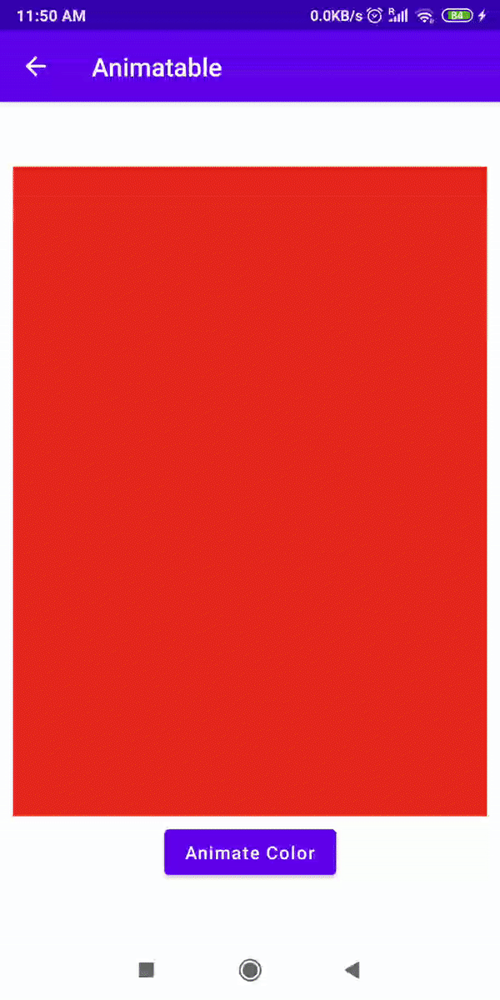
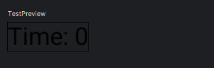
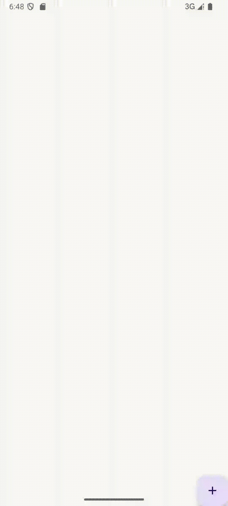

# 🌟 Анимации в Jetpack Compose

## 📱 Введение

Анимации в Jetpack Compose - это мощный инструмент для создания плавных и отзывчивых пользовательских интерфейсов. Они помогают пользователям лучше понимать изменения в UI и делают приложение более привлекательным.

В Jetpack Compose анимации используются для создания динамичного и интерактивного интерфейса. Они могут включать изменение размеров, цвета, положения и других свойств UI элементов.

## 🎯 Типы анимаций

### 1. Высокоуровневые анимации

* AnimatedVisibility
* AnimatedContent
* Crossfade
* animateContentSize

### 2. Анимации состояний

* animate\*AsState
* updateTransition
* rememberInfiniteTransition

### 3. Низкоуровневые анимации

* Animatable
* Animation specs
* Custom animations

## 💫 Основные API анимаций

Compose предоставляет удобные API, которые позволяют решать многие распространённые задачи по анимации. 
[AnimationQuickGuide.kt](https://github.com/android/snippets/blob/a7117c0da26b85a9e005d700a7ae9dec859bb8bd/compose/snippets/src/main/java/com/example/compose/snippets/animations/AnimationQuickGuide.kt#L132-L147)

### AnimationSpec

* Определяет параметры анимации (время, ускорение и т.д.):

````kotlin
val animationSpec = tween(durationMillis = 1000, easing = LinearEasing)

````

Для анимации появления и исчезновения элементов:

````kotlin
@Composable
fun AnimatedVisibilityExample() {
    var visible by remember { mutableStateOf(true) }
    
    Column {
        Button(onClick = { visible = !visible }) {
            Text("Показать/Скрыть")
        }
        AnimatedVisibility(visible = visible) {
            Text("Этот текст анимируется при появлении/исчезновении")
        }
    }
}
````

Другой вариант анимации видимости составного элемента — анимировать альфа-канал с течением времени с помощью [`animateFloatAsState`](https://developer.android.com/develop/ui/compose/animation/value-based#animate-as-state):


````kotlin
var visible by remember {
    mutableStateOf(true)
}
val animatedAlpha by animateFloatAsState(
    targetValue = if (visible) 1.0f else 0f,
    label = "alpha"
)
Box(
    modifier = Modifier
        .size(200.dp)
        **.graphicsLayer {**
            **alpha = animatedAlpha**
        **}**
        .clip(RoundedCornerShape(8.dp))
        .background(colorGreen)
        .align(Alignment.TopCenter)
) {
}
````

**Добавь**
Пример для анимации появления/исчезновения элементов:

````kotlin
var visible by remember { mutableStateOf(true) }

AnimatedVisibility(
    visible = visible,
    enter = fadeIn() + slideInHorizontally(),
    exit = fadeOut() + slideOutHorizontally()
) {
    Text("Анимированный текст")
}
````

### animate\*AsState

Для анимации отдельных значений:

````kotlin
var boxSize by remember { mutableStateOf(100.dp) }
val size by animateDpAsState(
    targetValue = boxSize,
    animationSpec = spring(
        dampingRatio = Spring.DampingRatioMediumBouncy,
        stiffness = Spring.StiffnessLow
    )
)

Box(
    modifier = Modifier
        .size(size)
        .background(MaterialTheme.colorScheme.primary)
        .clickable { boxSize = if (boxSize == 100.dp) 200.dp else 100.dp }
)
````

````kotlin
@Composable
fun AnimateColorExample() {
    var isDark by remember { mutableStateOf(false) }
    val color by animateColorAsState(if (isDark) Color.Black else Color.White)

    Button(
        onClick = { isDark = !isDark },
        colors = ButtonDefaults.buttonColors(backgroundColor = color)
    ) {
        Text(text = "Изменить цвет")
    }
}
````

### Анимация изменения цвета фона


````kotlin
val animatedColor by animateColorAsState(
    if (animateBackgroundColor) colorGreen else colorBlue,
    label = "цвет"
)
Column(
    modifier = Modifier.drawBehind {
        drawRect(animatedColor)
    }
) {
    // ваш компонент здесь
}
````

### Анимация изменения размера составного элемента


Compose позволяет анимировать размер составных элементов несколькими способами. Например **animateContentSize**() для анимации между изменениями размера составных элементов.

Например, если у вас есть поле с текстом, который может расширяться с одной до нескольких строк, вы можете использовать `Modifier.animateContentSize()` для более плавного перехода:

````kotlin
var расширенный с помощью запоминания { изменяемого состояния(false) }
Блок(
    модификатор = Модификатор
        .фон(цветСиний)
        **.animateContentSize()**
        .height(if (expanded) 400.dp else 200.dp)
        .fillMaxWidth()
        .clickable(
            interactionSource = remember { MutableInteractionSource() },
            indication = null
        ) {
            expanded = !expanded
        }

) {
}
````

### Модификаторы для Анимаций

* Анимация свойств через модификаторы:

````kotlin
Modifier
    .animateContentSize()
    .animateSize()
    .animateOffset()
````

**Основные:**

* animateContentSize для анимации изменения размера содержимого:

````kotlin
Modifier.animateContentSize()
````

* animateOffset для анимации смещения:

````kotlin
Modifier.animateOffset()
````

* graphicsLayer для более сложных анимаций, как вращение:

````kotlin
Modifier.graphicsLayer {
    rotationZ = 45f
}
````

## Простая анимация


**animate\*AsState**

* **Используется для анимации изменений состояния:**

### Использование animate\*AsState для изменения цвета animateColorAsState:

````kotlin
val color by animateColorAsState(if (isClicked) Color.Red else Color.Green)

````

### Использование animate\*AsState для изменения размера animateDpAsState:

````kotlin


@Composable
fun AnimateSizeExample() {
    var size by remember { mutableStateOf(100.dp) }
    val animatedSize by animateDpAsState(
        targetValue = size,
        animationSpec = tween(durationMillis = 1000)
    )

    Column {
        Button(onClick = { size = if (size == 100.dp) 200.dp else 100.dp }) {
            Text("Изменить размер")
        }
        Box(Modifier.size(animatedSize).background(Color.Blue))
    }
}
````

### Использование AnimatedVisibility

* **Для анимации появления и исчезновения элементов:**
  

````kotlin
fun AnimatedVisibilityExample() {  
    var visible by remember { mutableStateOf(true) }  
  
    Column () {  
        Text(" ")  
        Spacer(modifier = Modifier.height(160.dp))  
  
        Button(onClick = { visible = !visible }) {  
            Text("Показать/Скрыть")  
        }  
        AnimatedVisibility(visible = visible) {  
            Text("Этот текст анимируется при появлении/исчезновении")  
        }  
    }}
````



### Использование переходов (Transition):

````kotlin

val transition = updateTransition(targetState = isExpanded)
val size by transition.animateDp { state ->
    if (state) 200.dp else 100.dp
}
Box(Modifier.size(size))

````

### Сложные Анимации

Последовательные Анимации



* Использование animate\*AsState для несколько последовательных изменений:

````kotlin
@Composable  
fun SequenceAnimationExample() {  
    var size by remember { mutableStateOf(100.dp) }  
    val animatedSize by animateDpAsState(  
        targetValue = size,  
        animationSpec = keyframes {  
            durationMillis = 3000  
            100.dp at 0 using LinearEasing // Начинаем с 100.dp  
            200.dp at 1500 using FastOutSlowInEasing // Переходим к 200.dp через 1.5 секунды  
            150.dp at 3000 using LinearEasing // Заканчиваем на 150.dp  
        }  
    )  
  
    Column {  
        Button(onClick = { size = if (size == 100.dp) 200.dp else 100.dp }) {  
            Text("Запустить последовательность")  
        }  
        Box(Modifier.size(animatedSize).background(Color.Blue))  
    }  
}
````

### Анимации с переходами


* Использование AnimatedContent для анимации между состояниями:

````kotlin
@Composable
fun TransitionAnimationExample() {
    var showDetails by remember { mutableStateOf(false) }
    val transition = updateTransition(showDetails)

    Column {
        Button(onClick = { showDetails = !showDetails }) {
            Text("Показать детали")
        }
        transition.AnimatedContent {
            if (it) {
                Text("Детали: много текста")
            } else {
                Text("Кратко")
            }
        }
    }
}
````

### Keyframes для сложных эффектов:

````kotlin

val offset by animateDpAsState(
    targetValue = 100.dp,
    animationSpec = keyframes {
        durationMillis = 1000
        50.dp at 200
        150.dp at 500
    }
)
Box(Modifier.offset(y = offset))


````

### Жесты и анимация с draggable:

````kotlin

@Composable  
fun DraggableAnimationExample() {  
    val offsetX = remember { Animatable(0f) }  
    Box(  
        Modifier  
            .offset { IntOffset(offsetX.value.roundToInt(), 0) }  
            .draggable(  
                orientation = Orientation.Horizontal,  
                state = rememberDraggableState { delta ->  
                    CoroutineScope(Dispatchers.Main).launch {  
                        offsetX.snapTo(offsetX.value + delta)  
                    }  
                }            )  
    )  
  
}


````

### Анимация содержимого (AnimatedContent):

````kotlin

AnimatedContent(targetState = counter) { target ->
    Text("Count: $target")
}

````

## Анимация изменения состояния



````kotlin
@Composable
private fun AnimatableSample() {
    var isAnimated by remember { mutableStateOf(false) }

    val color = remember { Animatable(Color.DarkGray) }

    // animate to green/red based on `button click`
    LaunchedEffect(isAnimated) {
        color.animateTo(if (isAnimated) Color.Green else Color.Red, animationSpec = tween(2000))
    }

    Box(
        Modifier
            .fillMaxWidth()
            .fillMaxHeight(0.8f)
            .background(color.value)
    )
    Button(
        onClick = { isAnimated = !isAnimated },
        modifier = Modifier.padding(top = 10.dp)
    ) {
        Text(text = "Animate Color")
    }
}
````

## Анимация размера:


````kotlin
@Composable
fun CircleImage(imageSize: Dp) {
    Image(
        painter = painterResource(R.drawable.andy_rubin),
        contentDescription = "Circle Image",
        contentScale = ContentScale.Crop,  
        modifier = Modifier
            .size(imageSize)
            .clip(CircleShape) 
            .border(5.dp, Color.Gray, CircleShape) 
    )
}

@Composable
private fun AnimateDpAsState() {
    val isNeedExpansion = rememberSaveable{ mutableStateOf(false) }
    
    val animatedSizeDp: Dp by animateDpAsState(targetValue = if (isNeedExpansion.value) 350.dp else 100.dp)

    Column(horizontalAlignment = Alignment.CenterHorizontally) {
        CircleImage(animatedSizeDp)
        Button(
            onClick = { 
            isNeedExpansion.value = !isNeedExpansion.value 
            },
            modifier = Modifier
                .padding(top = 50.dp)
                .width(300.dp)
        ) {
            Text(text = "animateDpAsState")
        }
    }
}
````

## 📊 Визуализация в реальном времени

### Использование LaunchedEffect

````kotlin
@Composable  
fun Timer() {  
    var time by remember { mutableIntStateOf(0) }  
    LaunchedEffect(Unit) {  
        while (true) {  
            delay(1000)  
            time++  
        }  
    }  
    Text("Time: $time")  
}

````

### Работа с Flow



````kotlin
@Composable
fun FlowExample(flow: Flow<Int>) {
    val value by flow.collectAsState(initial = 0)
    Text("Flow value: $value")
}


````

## 🎨 Спецификации анимаций

### 1. Spring (Пружина)

````kotlin
spring(
    dampingRatio = Spring.DampingRatioMediumBouncy,
    stiffness = Spring.StiffnessLow
)
````

### 2. Tween (Промежуточная)

````kotlin
tween(
    durationMillis = 300,
    delayMillis = 50,
    easing = FastOutSlowInEasing
)
````

### 3. Keyframes (Ключевые кадры)

````kotlin
keyframes {
    durationMillis = 1000
    0.5f at 100
    0.8f at 500
    1f at 1000
}
````

## 📱 Практические примеры

Ранее в разделе JetpackCompose мы познакомились с созданием собственных компонентов, попрактикуемся с анимацией на примере создания анимированной кнопки.

### 

Кнопка с анимацией

````kotlin
var expanded by remember { mutableStateOf(false) }
Box(modifier = Modifier.fillMaxSize()) {
    AnimatedVisibility(expanded) {
        Card(modifier = Modifier.padding(16.dp)) {
            Text("Скрытый контент", modifier = Modifier.padding(16.dp))
        }
    }
    FloatingActionButton(
        onClick = { expanded = !expanded },
        modifier = Modifier.align(Alignment.BottomEnd)
    ) {
        Icon(Icons.Default.Add, "Показать")
    }
}

````

### 

**Анимированная кнопка с ripple эффектом**

````kotlin
@Composable  
fun AnimatedButton(  
    onClick: () -> Unit,  
    content: @Composable () -> Unit  
) {  
    var pressed by remember { mutableStateOf(false) }  
    val scale by animateFloatAsState(  
        targetValue = if (pressed) 0.95f else 1f,  
        animationSpec = spring(dampingRatio = Spring.DampingRatioMediumBouncy)  
    )  
  
    Surface(  
        modifier = Modifier  
            .scale(scale)  
            .clickable(  
                interactionSource = remember { MutableInteractionSource() },  
                indication = rememberRipple(),  
                onClick = {  
                    pressed = true  
                    onClick()  
                }  
            )  
            .pointerInput(Unit) {  
                detectTapGestures(onPress = {  
                    pressed = true  
                    tryAwaitRelease()  
                    pressed = false  
                })  
            },  
        shape = RoundedCornerShape(8.dp),  
        color = MaterialTheme.colorScheme.primary  
    ) {  
        Box(  
            modifier = Modifier.padding(16.dp),  
            contentAlignment = Alignment.Center  
        ) {  
            content()  
        }  
    }}
````

### Анимированная карточка с раскрытием

````kotlin
@Composable
fun ExpandableCard(
    title: String,
    content: String
) {
    var expanded by remember { mutableStateOf(false) }
    val height by animateDpAsState(
        targetValue = if (expanded) 200.dp else 80.dp
    )

    Card(
        modifier = Modifier
            .fillMaxWidth()
            .height(height)
            .clickable { expanded = !expanded }
            .animateContentSize(),
        elevation = CardDefaults.cardElevation(4.dp)
    ) {
        Column(
            modifier = Modifier.padding(16.dp)
        ) {
            Text(
                text = title,
                style = MaterialTheme.typography.titleLarge
            )
            if (expanded) {
                Spacer(Modifier.height(8.dp))
                Text(
                    text = content,
                    style = MaterialTheme.typography.bodyMedium
                )
            }
        }
    }
}
````

## 🎯 Рекомендации по использованию

### Выбор типа анимации

Для упрощения выбора подходящей анимации на данной схеме представлена рекомендованная Google схема выбора подходящей анимации для пользовательских компонентов.


### Оптимизация производительности

1. Избегайте сложных анимаций для больших списков
1. Используйте LaunchedEffect для управления анимациями
1. Отключайте анимации при низком заряде батареи

## ✅ Чек-лист реализации анимаций

* [ ] Анимации плавные и естественные
* [ ] Длительность анимаций оптимальная
* [ ] Учтена производительность
* [ ] Анимации информативны

## 📚 Полезные ресурсы

* [Официальная документация по анимациям](https://developer.android.com/jetpack/compose/animation)
* [Примеры анимаций Compose](https://github.com/android/compose-samples)
* [Material Motion System](https://m3.material.io/styles/motion/overview)

## 🎥 Видео материалы

[](https://www.youtube.com/watch?v=6ZZDPILtYlA&pp=ygUZamV0cGFjayBjb21wb3NlIGFuaW1hdGlvbg%3D%3D)

[](https://www.youtube.com/watch?v=D73-3nDtVBs&list=PL1b73-6UjePBj4063fFyyT0SC1VV7hQq2)
[](https://www.youtube.com/watch?v=GxL_WD2g6WE&list=PL1ZHrB4A5N8VftPHz2laWsDJim-X8dwA5)
