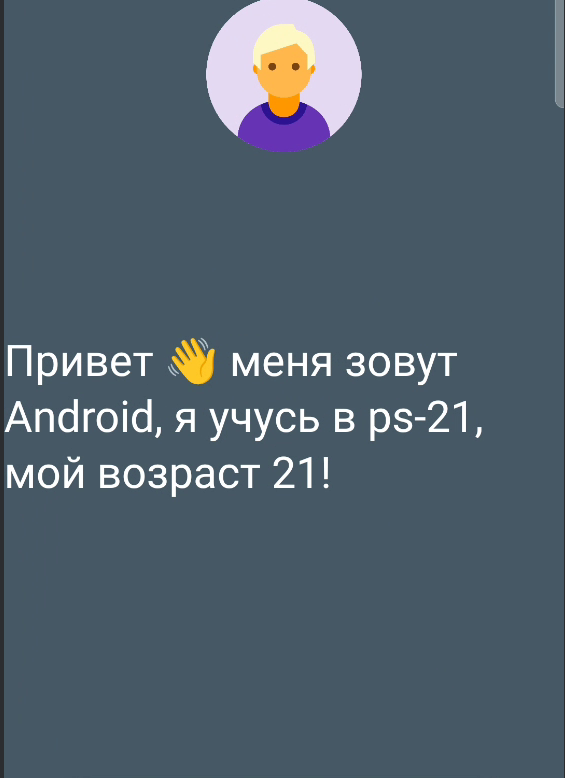

**Добавьте изображение в проект:**


* Скопируйте изображение (например, `test.png`) в папку `app/src/main/res/drawable`.

**Импортируйте необходимые компоненты:**

````kotlin
   import androidx.compose.foundation.Image
   import androidx.compose.ui.res.painterResource
   import androidx.compose.ui.Alignment
   import androidx.compose.foundation.layout.Column
   import androidx.compose.foundation.layout.Spacer
   import androidx.compose.foundation.layout.height
   import androidx.compose.ui.unit.dp
````

**Измените содержимое функции `Greeting`:**

````kotlin
@Composable
fun Greeting(name: String, group:String, age:Int,  modifier: Modifier = Modifier) {
    Column(
        horizontalAlignment = Alignment.CenterHorizontally
    ) {
        Image(
            painter = painterResource(id = R.drawable.avatar),
            contentDescription = "Avatar",
            modifier = Modifier.height(300.dp)
        )
        Spacer(modifier = Modifier.height(16.dp))
        Text(
          //Реализация FIO
            modifier = modifier.padding(20.dp),
                style = MaterialTheme.typography.headlineMedium, color = White
        )
    }
}
````

**Column** Column/Столбец - это компонуемый элемент макета, который используется для размещения всех его дочерних элементов вертикально один за другим. Он похож на LinearLayout с вертикальной ориентацией.

**Image** Чтобы отобразить изображение, мы можем использовать функцию composable Image.

````kotlin
@Composable
fun SimpleImageComponent() {
    // Image is a composable that is used to display some image.
    val image = imageResource(R.drawable.mindorks_cover)
    Column(
        modifier = Modifier.padding(16.dp)
    ) {
        Image(image)
    }
}
````

**Запустите приложение**


Результат

## ✏️ Практика:

Модифицируйте свое приложение добавивив свое изображение


📚 Полезные ресурсы

## 🎥 Видео материалы
