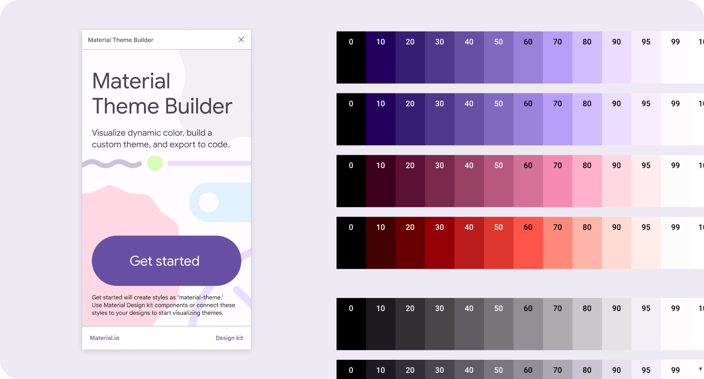
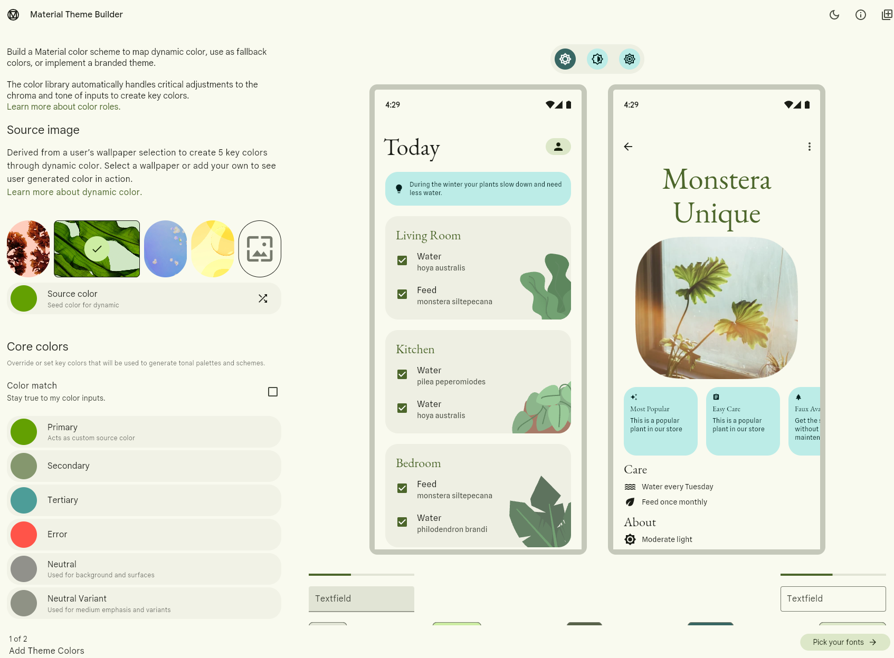
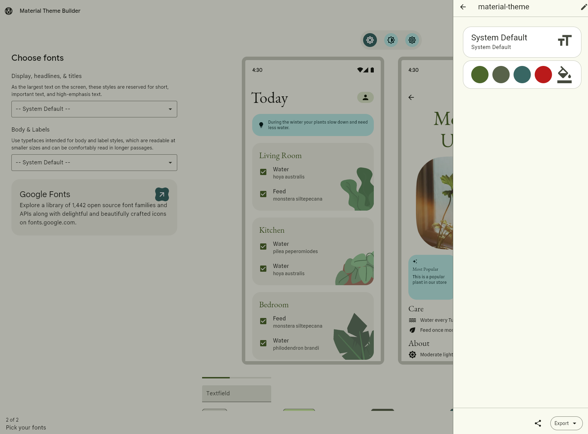
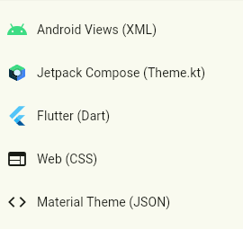
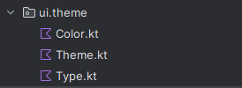
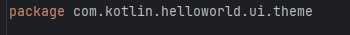
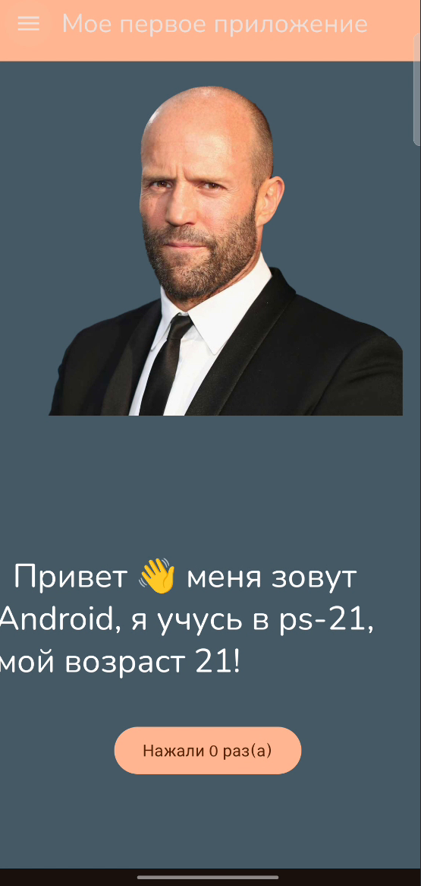

## 🌟 Помимо ручного редактирования и создания темы для Material Design 3 существует готовый генератор палитры с добавлением шрифтов и цветов по вашему выбору или на основе картинки. Для этого перейдите на сайт 

По ссылке

* [material-theme-builder](https://material-foundation.github.io/material-theme-builder/)

**Сайт интуитивно понятен и не требует дополнительных навыков в программирование**

**Достаточно выбрать подходящие варианты и экспортировать тему**

**В нашем случае мы используем jetpack Compose**

После добавляем в проект заменяя файлы нашей темы, согласно инструкции из архива с экспортом или меняя названия темы в полученных файлах на нашу тему.

**🔥ВАЖНО: При активированном флаге   dynamicColor: Boolean = true приложение по умолчанию использует тему оформления телефона, для использования кастомной темы достаточно выбрать ее прописав или поставив флаг dynamicColor: Boolean = false**

**Пример подключенной сгенерированной темы**

## 📚 Полезные ресурсы

## 🎥 Видео материалы
