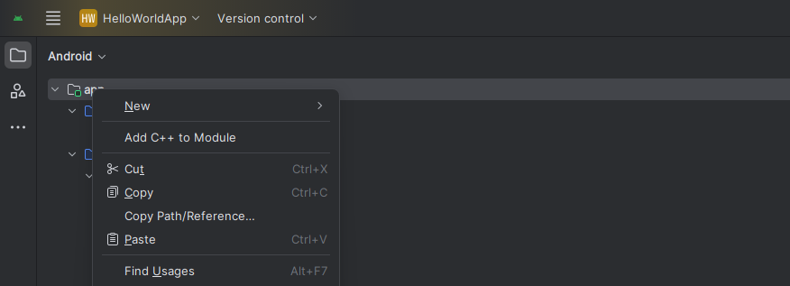
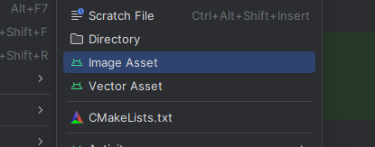
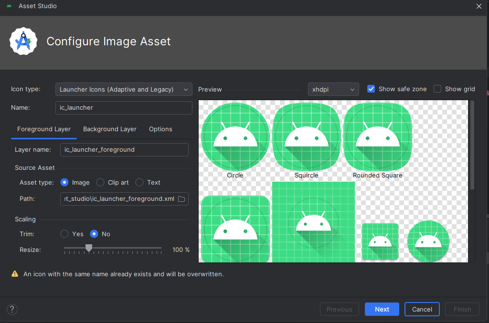
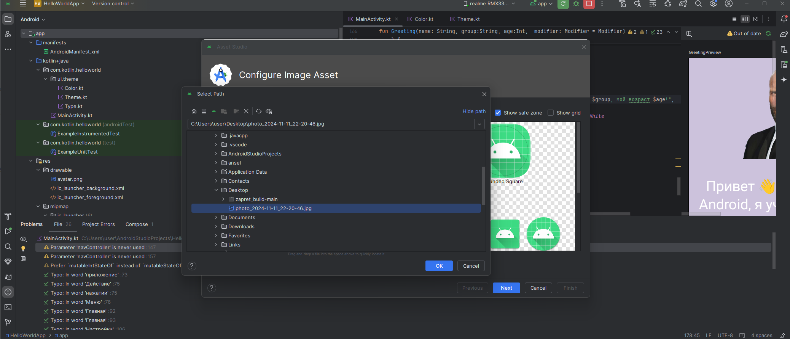
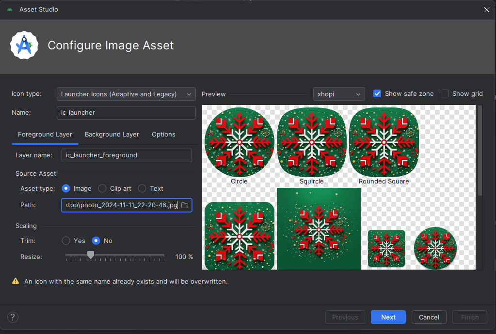
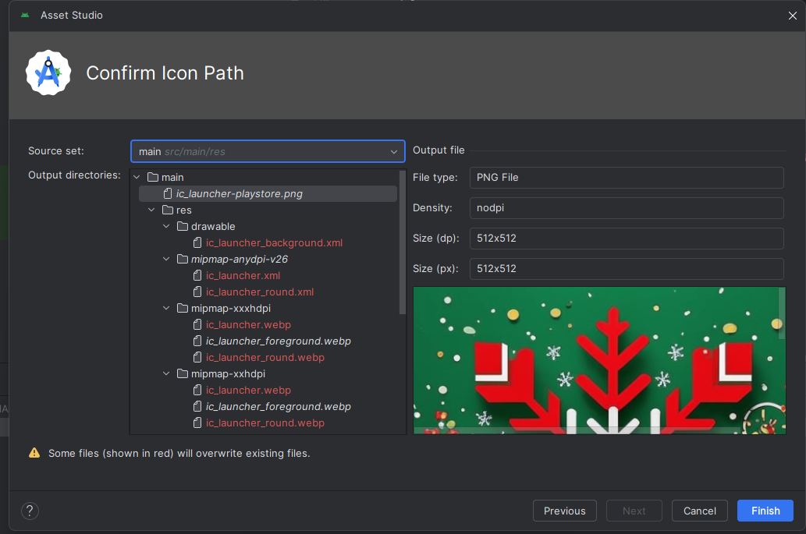
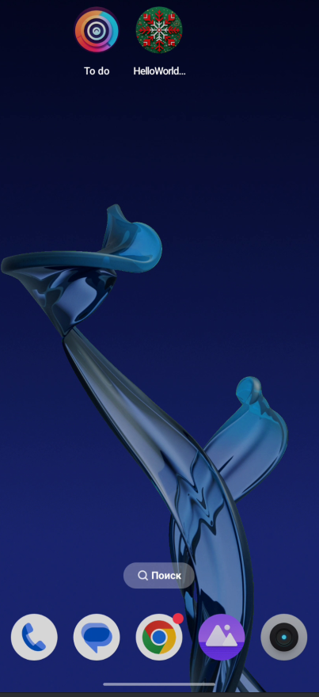

## 🧧 Добавление иконки приложения

**Для добавление иконки не требуется дополнительной модификации или доработки кода, достаточно импортировать нужное изображение**

Правая кнопка по нашему проекту

Выбираем New, Image asset

По умолчанию показывает во всех вариантах стандартный вариант

Импортируем через Path, выбираю путь до нужного изображения

Далее можно в ручную подогнать под нужный размер и форму

Подтверждаем замену предыдущих иконок

Запускаем

## 📚 Полезные ресурсы

## 🎥 Видео материалы
