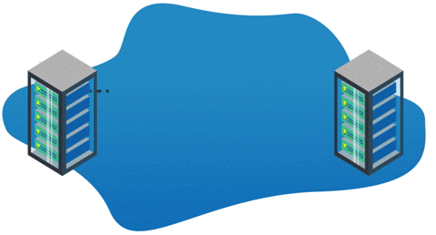
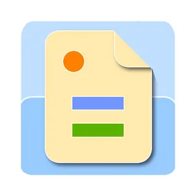

# 🗂️ Room Database

## 📱 Введение



Room - это библиотека для работы с SQLite в Android, предоставляющая удобный уровень абстракции над базой данных.
Она помогает сохранять, удалять и получать данные, как профессиональный органайзер.

* **Почему Room?**
  
  * Упрощает работу с SQLite (не нужно писать сложные SQL-запросы вручную).
  
  * Поддержка сложных запросов и транзакций.
  
  * Более структурированный подход к хранению данных с минимальным количеством шаблонного кода.
  
  * Проверяет ошибки на этапе компиляции (если запрос неправильный, приложение не соберется). Обработка миграций базы данных на уровне библиотеки.
  
  * Совместима с Kotlin Coroutines и Flow для асинхронной работы.

* Для работы с базами данных SQLite, особенно когда требуется ORM (Object-Relational Mapping).

* Поддерживает миграции схем базы данных.

**Преимущества:**

* Компилируемые запросы, что снижает вероятность ошибок SQL.
* Поддержка LiveData для реактивного обновления UI.

**Недостатки:**

* Более сложная настройка по сравнению с SharedPreferences. Требует больше кода для настройки (создание Entity, DAO, Database).
* Может быть избыточным для простых настроек.


**Основные компоненты Room:**

1. **Entity (Сущность)** — как таблица в Excel.  Каждое свойство класса - колонка таблицы.

2. **DAO (Data Access Object)** — набор команд для работы с таблицей (добавить, удалить, получить данные).  Определяющий методы для работы с базой данных (запросы на добавление, чтение, обновление, удаление данных - CRUD операции).

3. **Database** — сама база данных, которая связывает все таблицы и DAO.  Абстрактный класс, расширяющий RoomDatabase, создающий экземпляр базы данных и предоставляющий доступ к DAO.

## 🛠 Настройка проекта

### Добавление зависимостей

4. Добавьте KSP в Project build.gradle:

````kotlin
plugins {
    id("com.google.devtools.ksp") version "1.9.21-1.0.15" apply false
}
````

5. В Module build.gradle:

````kotlin
plugins {
    id("com.google.devtools.ksp")
}

dependencies {
    val roomVersion = "2.6.1"
    
    implementation("androidx.room:room-runtime:$roomVersion")
    implementation("androidx.room:room-ktx:$roomVersion")
    ksp("androidx.room:room-compiler:$roomVersion")
}
````

## 🏗️ Основные компоненты Room

### 1. Entity (Сущность)

Определяет структуру таблицы:

````kotlin
@Entity(tableName = "notes") // Название таблицы
data class Note(
    @PrimaryKey(autoGenerate = true) // Уникальный ID (генерируется автоматически)
    val id: Int = 0,
    
    @ColumnInfo(name = "title") // Название столбца 
    val title: String,
    
    @ColumnInfo(name = "content") // Название столбца 
    val content: String,
    
    @ColumnInfo(name = "created_at") // Название столбца 
    val createdAt: Long = System.currentTimeMillis()
)
````

**Разбор:**

* `@Entity` — отмечает класс как таблицу.

* `@PrimaryKey` — уникальный идентификатор.

* `@ColumnInfo` — задает имя столбца (если не указать, будет совпадать с именем переменной).

### 2. DAO (Data Access Object)

Определяет методы для работы с базой данных:

````kotlin
@Dao  // Data Access Object
interface NoteDao {
    @Query("SELECT * FROM notes ORDER BY created_at DESC")
    fun getAllNotes(): Flow<List<Note>> // Получить все заметки
    
    @Query("SELECT * FROM notes WHERE id = :noteId")
    suspend fun getNoteById(noteId: Int): Note? // Получить заметку
    
    @Insert
    suspend fun insertNote(note: Note): Long // Добавить заметку
    
    @Update
    suspend fun updateNote(note: Note)   // Обновить заметку
    
    @Delete
    suspend fun deleteNote(note: Note)   // Удалить заметку
    
    @Query("DELETE FROM notes")
    suspend fun deleteAllNotes()   // Удалить все заметки
}
````

**Разбор:**

* `@Insert`, `@Delete` — готовые операции.

* `@Query` — ручной SQL-запрос.

* `suspend` — функция работает в фоне (корутины).

* `Flow` — автоматическое обновление данных при изменении таблицы.

### 3. Database

Определяет базу данных и связывает компоненты:

````kotlin
@Database(
    entities = [Note::class],  // Список таблиц
    version = 1, // Версия базы (увеличивайте при изменении структуры)
    exportSchema = false
)
abstract class AppDatabase : RoomDatabase() {
    abstract fun noteDao(): NoteDao // Доступ к DAO

    companion object {
        @Volatile
        private var INSTANCE: AppDatabase? = null  // Создание базы данных ==

        fun getDatabase(context: Context): AppDatabase {
            return INSTANCE ?: synchronized(this) {
                val instance = Room.databaseBuilder(
                    context.applicationContext,
                    AppDatabase::class.java,
                    "app_database"  // Имя файла базы
                ).build()
                INSTANCE = instance
                instance
            }
        }
    }
}
````

## 📱 Практический пример: Приложение заметок

### Repository

````kotlin
class NoteRepository(private val noteDao: NoteDao) {
    val allNotes: Flow<List<Note>> = noteDao.getAllNotes()
    
    suspend fun insertNote(note: Note) {
        noteDao.insertNote(note)
    }
    
    suspend fun updateNote(note: Note) {
        noteDao.updateNote(note)
    }
    
    suspend fun deleteNote(note: Note) {
        noteDao.deleteNote(note)
    }
}
````

### ViewModel

````kotlin
class NoteViewModel(application: Application) : AndroidViewModel(application) {
    private val repository: NoteRepository
    val allNotes: StateFlow<List<Note>>

    init {
        val noteDao = AppDatabase.getDatabase(application).noteDao()
        repository = NoteRepository(noteDao)
        allNotes = repository.allNotes.stateIn(
            viewModelScope,
            SharingStarted.WhileSubscribed(5000),
            emptyList()
        )
    }

    fun addNote(title: String, content: String) {
        viewModelScope.launch {
            repository.insertNote(Note(title = title, content = content))
        }
    }

    fun deleteNote(note: Note) {
        viewModelScope.launch {
            repository.deleteNote(note)
        }
    }
}
````

### UI

````kotlin
@Composable
fun NotesScreen(
    viewModel: NoteViewModel = viewModel()
) {
    val notes by viewModel.allNotes.collectAsState()
    var showDialog by remember { mutableStateOf(false) }
    var title by remember { mutableStateOf("") }
    var content by remember { mutableStateOf("") }

    Column(modifier = Modifier.fillMaxSize()) {
        // Список заметок
        LazyColumn(
            modifier = Modifier.weight(1f),
            contentPadding = PaddingValues(16.dp)
        ) {
            items(notes) { note ->
                NoteItem(
                    note = note,
                    onDelete = { viewModel.deleteNote(note) }
                )
                Spacer(modifier = Modifier.height(8.dp))
            }
        }

        // FAB для добавления заметки
        FloatingActionButton(
            onClick = { showDialog = true },
            modifier = Modifier
                .padding(16.dp)
                .align(Alignment.End)
        ) {
            Icon(Icons.Default.Add, "Добавить заметку")
        }
    }

    // Диалог добавления заметки
    if (showDialog) {
        AlertDialog(
            onDismissRequest = { showDialog = false },
            title = { Text("Новая заметка") },
            text = {
                Column {
                    TextField(
                        value = title,
                        onValueChange = { title = it },
                        label = { Text("Заголовок") }
                    )
                    Spacer(modifier = Modifier.height(8.dp))
                    TextField(
                        value = content,
                        onValueChange = { content = it },
                        label = { Text("Содержание") }
                    )
                }
            },
            confirmButton = {
                Button(onClick = {
                    viewModel.addNote(title, content)
                    title = ""
                    content = ""
                    showDialog = false
                }) {
                    Text("Добавить")
                }
            },
            dismissButton = {
                Button(onClick = { showDialog = false }) {
                    Text("Отмена")
                }
            }
        )
    }
}
````

## 🔍 Дополнительные возможности

### Миграции

````kotlin
val MIGRATION_1_2 = object : Migration(1, 2) {
    override fun migrate(database: SupportSQLiteDatabase) {
        database.execSQL(
            "ALTER TABLE notes ADD COLUMN priority INTEGER NOT NULL DEFAULT 0"
        )
    }
}
````

### Отношения между таблицами

````kotlin
@Entity(tableName = "categories")
data class Category(
    @PrimaryKey val id: Int,
    val name: String
)

@Entity(
    tableName = "notes",
    foreignKeys = [
        ForeignKey(
            entity = Category::class,
            parentColumns = ["id"],
            childColumns = ["category_id"]
        )
    ]
)
data class Note(
    @PrimaryKey(autoGenerate = true) val id: Int = 0,
    val title: String,
    @ColumnInfo(name = "category_id") val categoryId: Int
)
````

## 📚 Полезные ресурсы

* [Библиотека «Room» для начинающего Android-разработчика](https://habr.com/ru/articles/713518/)
* [Библиотека «Room» Android dev](https://developer.android.com/jetpack/androidx/releases/room?hl=ru)
* [Частые проблемы](https://devgem.vercel.app/posts/resolving-issues-with-hilt-room-and-ksp-in-android-development)
* [Room Documentation](https://developer.android.com/training/data-storage/room)
* [Room KSP Migration](https://developer.android.com/build/migrate-to-ksp)
* [Room with Coroutines](https://developer.android.com/training/data-storage/room/async-queries)
* [Testing Room](https://developer.android.com/training/data-storage/room/testing-db)

## 🎥 Видео материалы

[](https://www.youtube.com/watch?v=lwAvI3WDXBY&list=PLSrm9z4zp4mEPOfZNV9O-crOhoMa0G2-o)
[](https://www.youtube.com/watch?v=BVAslimaGSk&pp=ygUVYW5kcm9pZCBzcWxpdGUga290bGlu)
