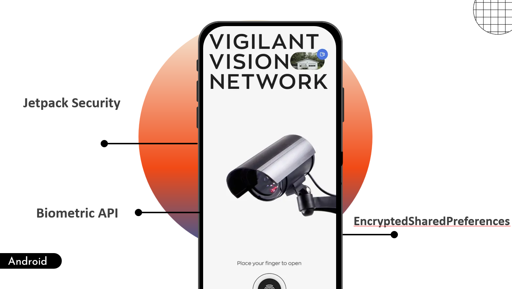
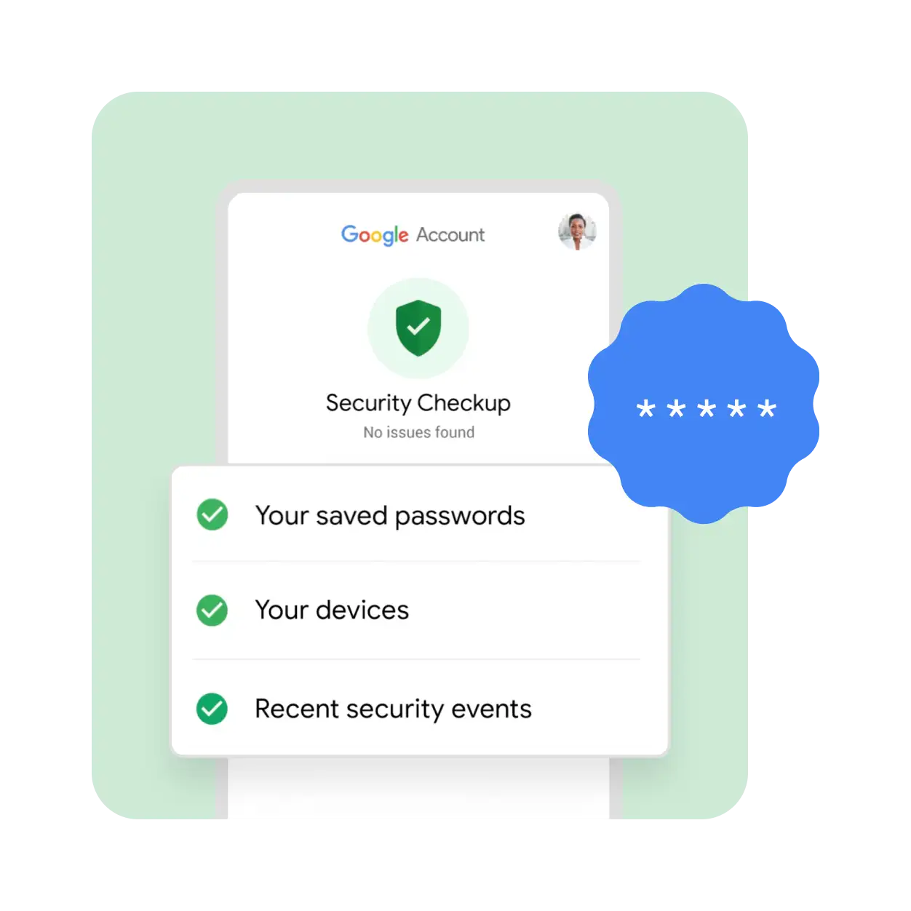
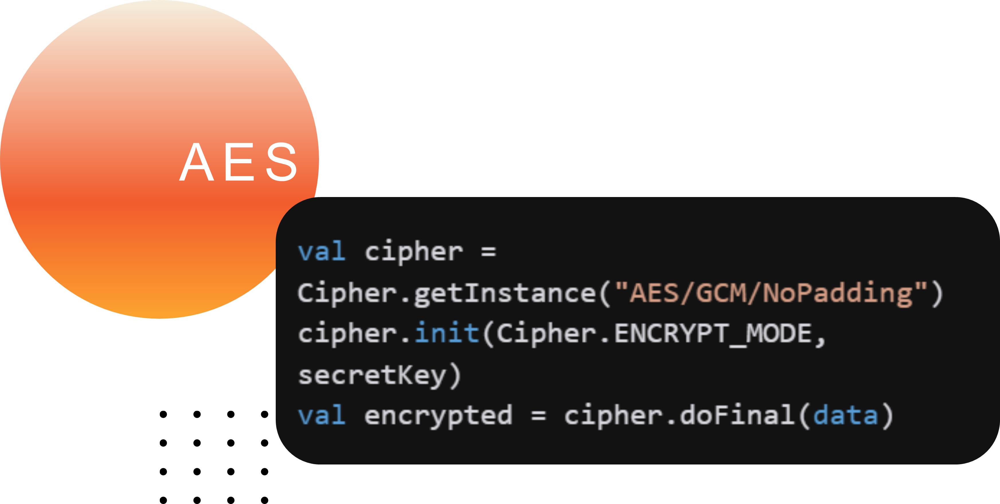
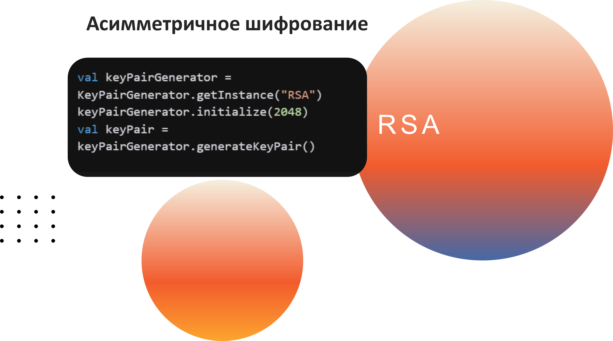
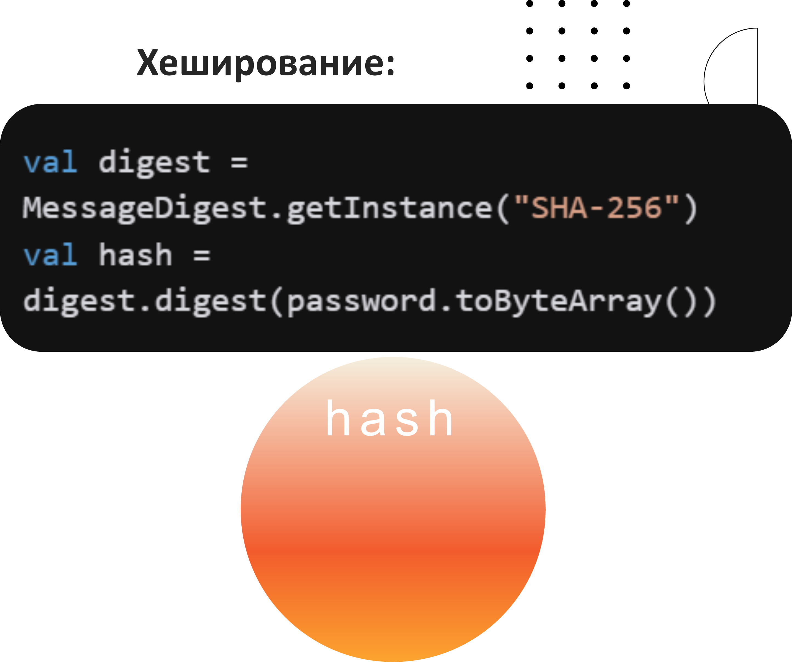
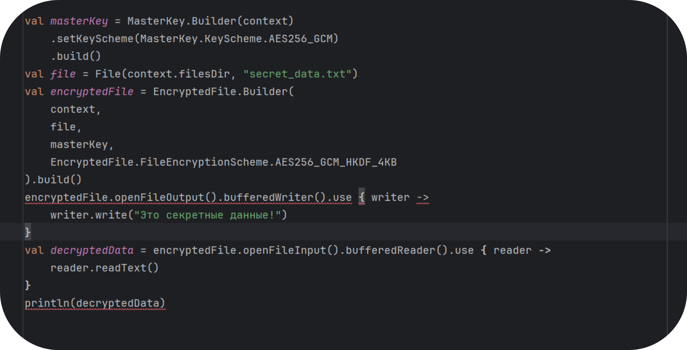

# 💼 Защита данных в Android

## 📱 Введение

Защита данных - это комплекс мер, направленных на обеспечение безопасности и конфиденциальности информации в приложении.



## 🛡️ Основные концепции
**Зачем нужна безопасность?**

*   **Защита данных пользователей:** Пароли, токены, личная информация, финансовые данные – всё это должно быть надежно защищено.
*   **Предотвращение атак:** SQL Injection, Cross-Site Scripting (XSS), Man-in-the-Middle (MitM) и другие атаки могут привести к утечке данных, взлому приложения и другим серьезным последствиям.
*   **Репутация:** Если ваше приложение будет взломано, это может нанести серьезный ущерб вашей репутации и доверию пользователей.
*   **Соблюдение требований:** Многие законы и стандарты (например, GDPR) требуют защиты персональных данных.
* **Предотвращение несанкционированного доступа** к функциональности и ресурсам приложения.
### Типы защиты данных

1. Шифрование данных
1. Аутентификация и авторизация
1. Безопасное хранение
1. Защита передачи данных

## Введение в защиту данных

* **Защита данных**: это комплекс мер и технологий, направленных на обеспечение безопасности и конфиденциальности информации, хранящейся в приложении. В современных приложениях крайне важно защищать личные данные пользователей от несанкционированного доступа, утечек и взломов.

На начальном этапе разработки следует разобраться в основных понятиях и алгоритмах, после чего перейти к практическим примерам реализации защиты данных в Android.

**Основы защиты данных**

* **Шифрование данных** – Процесс преобразования информации в недоступный для чтения вид с использованием алгоритмов шифрования. Для симметричного шифрования часто применяют AES (Advanced Encryption Standard) в режимах CBC или GCM, а для проверки целостности — HMAC.

* **Аутентификация и авторизация** – Механизмы проверки подлинности пользователя и контроля доступа к ресурсам приложения. В Android для этого часто используются биометрия, PIN-коды, OAuth и другие методы.

* **Безопасное хранение** – применение специальных методов и API для защиты данных, хранящихся на устройстве (например, EncryptedSharedPreferences, безопасное хранение в базе данных). Среди них:

* **EncryptedSharedPreferences** – для безопасного хранения пар «ключ–значение».

* **EncryptedFile** – для шифрования файлов, сохранённых во внутреннем или внешнем хранилище.

* Возможность интеграции с зашифрованными базами данных (например, Room с дополнительными библиотеками).

* **Управление разрешениями**: Запрашивание и использование разрешений только при необходимости.

* **Обфускация кода**: Сложность для реверс-инжиниринга вашего приложения.

## 🔐 Рекомендуемые алгоритмы

### Таблица рекомендаций

|Категория<br>|Рекомендация|
|---------|------------|
|Шифр|AES в режиме CBC или GCM с 256-битными ключами (например, `AES/GCM/NoPadding` ).|
|Дайджест сообщений|Семейство SHA-2 (например, `SHA-256` )|
|Мак|Семейство HMAC SHA-2 (например, `HMACSHA256` )|
|Подпись|\|**Шифрование данных**\|AES в режиме CBC или GCM с 256-битными ключами (например, `AES/GCM/NoPadding`)\|<br><br>\|**Хэширование/Дайджест**\|Семейство SHA-2 (например, `SHA-256`)\|<br><br>\|**MAC (код аутентификации сообщений)**\|HMAC SHA-2 (например, `HMACSHA256`)\|<br><br>\|**Электронная подпись**\|SHA-2 с ECDSA (например, `SHA256withECDSA`)\||

### Визуальное представление





### Меры по защите данных в приложении

* **Шифрование файлов**: При сохранении файлов используйте алгоритмы шифрования (например, AES) для защиты данных.

* Реализуйте методы шифрования при записи и дешифрования при чтении.

* При разработке уделяйте внимание корректной работе с потоками ввода/вывода, чтобы не допустить утечек памяти.

* **Аутентификация пользователей**: Применяйте биометрическую аутентификацию (например, отпечаток пальца или Face ID) для предоставления доступа к защищённым данным с помощью API `BiometricPrompt`. Это позволит добавлять дополнительный уровень защиты перед доступом к зашифрованным данным.

* **Контроль доступа**  
  Помимо шифрования, продумайте архитектуру приложения так, чтобы доступ к конфиденциальной информации получали только авторизованные пользователи.

### Безопасное хранение

1. Используйте внутреннее хранилище для конфиденциальных данных
1. Шифруйте чувствительные данные
1. Не храните секреты в исходном коде
1. Используйте Android Keystore для ключей


## 💡  Методы защиты данных в Android

### 1. EncryptedSharedPreferences

* **EncryptedSharedPreferences**  Позволяют сохранять данные в виде пар «ключ–значение», автоматически шифруя их с помощью заданных алгоритмов. Это удобный способ для хранения токенов, паролей и настроек.

````kotlin
@Composable
fun SecurePreferencesExample() {
    val context = LocalContext.current
    val masterKey = MasterKey.Builder(context)
        .setKeyScheme(MasterKey.KeyScheme.AES256_GCM)
        .build()

    val encryptedPrefs = EncryptedSharedPreferences.create(
        context,
        "secure_prefs",
        masterKey,
        EncryptedSharedPreferences.PrefKeyEncryptionScheme.AES256_SIV,
        EncryptedSharedPreferences.PrefValueEncryptionScheme.AES256_GCM
    )

    var secretText by remember { mutableStateOf("") }

    Column(modifier = Modifier.padding(16.dp)) {
        OutlinedTextField(
            value = secretText,
            onValueChange = { secretText = it },
            label = { Text("Секретные данные") }
        )

        Button(onClick = {
            encryptedPrefs.edit()
                .putString("secret_key", secretText)
                .apply()
        }) {
            Text("Сохранить")
        }
    }
}
````

### 2. EncryptedFile

**EncryptedFile**  
Позволяет шифровать и дешифровать файлы, используя надежные алгоритмы (например, AES256_GCM_HKDF_4KB). Подходит для защиты конфиденциальных документов, логов или медиафайлов.

````kotlin
fun saveSecureFile(context: Context, data: String) {
    val masterKey = MasterKey.Builder(context)
        .setKeyScheme(MasterKey.KeyScheme.AES256_GCM)
        .build()

    val file = File(context.filesDir, "secret.txt")
    val encryptedFile = EncryptedFile.Builder(
        context,
        file,
        masterKey,
        EncryptedFile.FileEncryptionScheme.AES256_GCM_HKDF_4KB
    ).build()

    encryptedFile.openFileOutput().use { output ->
        output.write(data.toByteArray())
    }
}
````

### 3. Биометрическая аутентификация

**Аутентификация**  
Применение биометрических методов (отпечаток пальца, распознавание лица) и OAuth позволяет обеспечить контроль доступа к защищённым данным.\*\*\*\*

````kotlin
@Composable
fun BiometricAuthExample() {
    val context = LocalContext.current
    val biometricPrompt = BiometricPrompt(
        context as FragmentActivity(),
        object : BiometricPrompt.AuthenticationCallback() {
            override fun onAuthenticationSucceeded(result: BiometricPrompt.AuthenticationResult) {
                // Доступ разрешен
            }
        }
    )

    Button(onClick = {
        val promptInfo = BiometricPrompt.PromptInfo.Builder()
            .setTitle("Аутентификация")
            .setSubtitle("Используйте биометрию для доступа")
            .setNegativeButtonText("Отмена")
            .build()
        biometricPrompt.authenticate(promptInfo)
    }) {
        Text("Войти с биометрией")
    }
}
````

* **Безопасное хранение в базах данных**  
  Room и SQLite можно использовать в сочетании с дополнительными библиотеками для шифрования, чтобы защитить структурированные данные.

## 🚀 Лучшие практики

### 1. Шифрование данных

* Используйте современные алгоритмы шифрования
* Безопасно храните ключи шифрования
* Применяйте соль для хэширования
* Регулярно обновляйте ключи

### 2. Аутентификация

* Используйте многофакторную аутентификацию
* Применяйте биометрию где возможно
* Ограничивайте количество попыток входа
* Используйте токены с ограниченным временем жизни

### 3. Хранение данных

* Используйте EncryptedSharedPreferences для конфиденциальных данных
* Применяйте EncryptedFile для файлов
* Шифруйте базы данных
* Очищайте данные при выходе

## 🛡️ Практический пример


Давайте рассмотрим пример шифрования данных с использованием **Jetpack Security.**\*\* Этот пример показывает, как можно легко и безопасно хранить данные в зашифрованном виде с EncryptedFile.

#### **Создаем мастер-ключ**

````kotlin
val masterKey = MasterKey.Builder(context)
    .setKeyScheme(MasterKey.KeyScheme.AES256_GCM)
    .build()
````

#### **Создаем зашифрованный файл**

````kotlin
val file = File(context.filesDir, "secret_data.txt")

val encryptedFile = EncryptedFile.Builder(
    context,
    file,
    masterKey,
    EncryptedFile.FileEncryptionScheme.AES256_GCM_HKDF_4KB
).build()
````

#### **Шифруем данные**

````kotlin
encryptedFile.openFileOutput().bufferedWriter().use { writer ->
    writer.write("Это секретные данные!")
}
````

**Расшифровываем данные**

````kotlin
val decryptedData = encryptedFile.openFileInput().bufferedReader().use { reader ->
    reader.readText()
}

println(decryptedData) // Вывод: "Это секретные данные!"
````

**1.MasterKey: Используется для создания ключа шифрования.**

**2.EncryptedFile: Предоставляет API для работы с зашифрованными файлами.**

**3.BufferedWriter/BufferedReader: Для записи и чтения данных.**

**Модификаторы и свойства:**

**•FileEncryptionScheme: Определяет схему шифрования (AES256_GCM_HKDF_4KB).**

**•KeyScheme: Определяет схему генерации ключа (AES256_GCM).**

## 🛡️ Безопасность данных

### Шифрование данных

````kotlin
val masterKey = MasterKey.Builder(context)
    .setKeyScheme(MasterKey.KeyScheme.AES256_GCM)
    .build()

val encryptedSharedPreferences = EncryptedSharedPreferences.create(
    context,
    "secret_settings",
    masterKey,
    EncryptedSharedPreferences.PrefKeyEncryptionScheme.AES256_SIV,
    EncryptedSharedPreferences.PrefValueEncryptionScheme.AES256_GCM
)
````


\## 📚 Полезные ресурсы
*   OWASP Mobile Security Project: [https://owasp.org/www-project-mobile-security/](https://owasp.org/www-project-mobile-security/)
*   Документацию Android по безопасности: [https://developer.android.com/training/articles/security-tips](https://developer.android.com/training/articles/security-tips)

  **Статьи и руководства по безопасности Android.**

* [Android Security Best Practices](https://developer.android.com/topic/security/best-practices)
* [Jetpack Security](https://developer.android.com/topic/security/data)
* [Encryption on Android](https://developer.android.com/guide/topics/security/cryptography)
* [Biometric Authentication](https://developer.android.com/training/sign-in/biometric-auth)

## 🎥 Видео материалы

[](https://www.youtube.com/watch?v=JCBVDAXamrY&pp=ygUiYW5kcm9pZCDQl9Cw0YnQuNGC0LAg0LTQsNC90L3Ri9GFIA%3D%3D)

[](https://www.youtube.com/watch?v=XMaQNN9YpKk&pp=ygUSYW5kcm9pZCBEYXRhIFN0b3Jl)
