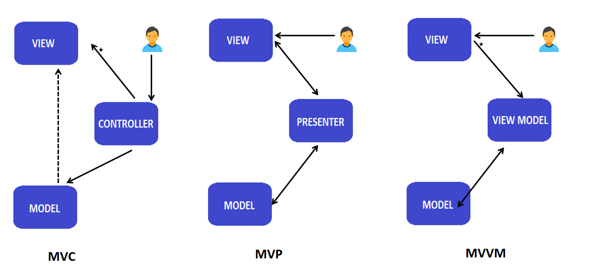

# 📊 Архитектурные паттерны в Android

## 📱 Введение

Архитектурные паттерны помогают организовать код приложения, делая его более поддерживаемым, тестируемым и масштабируемым.


## Зачем нужна архитектура? 

Представьте, что вы строите дом. Можно просто накидать кирпичей и надеяться, что получится что-то похожее на дом. Но, скорее всего, такой дом будет неустойчивым, неудобным и сложным в ремонте. То же самое и с приложениями. Если писать код без какой-либо структуры, то со временем он превратится в "спагетти-код", в котором будет сложно разобраться, сложно вносить изменения и сложно тестировать.

Архитектура – это как чертеж дома. Она определяет, из каких "комнат" (компонентов) будет состоять приложение, как эти "комнаты" будут связаны друг с другом, и кто за что отвечает.

**Преимущества хорошей архитектуры:**

*   **Разделение ответственности:** Каждый компонент отвечает за свою часть логики.
*   **Тестируемость:** Компоненты можно тестировать изолированно друг от друга.
*   **Поддерживаемость:** Легче вносить изменения и исправлять ошибки.
*   **Масштабируемость:** Легче добавлять новые функции.
*   **Повторное использование кода:** Компоненты можно использовать в разных частях приложения.
*   **Читаемость кода:** Код становится более понятным и структурированным.
## 🎯 Основные паттерны

### 1. MVC (Model-View-Controller)
**Описание**: Классический паттерн, разделяющий приложение на три компонента:
- **Model**: Данные и бизнес-логика
- **View**: Отображение данных пользователю
- **Controller**: Обработка действий пользователя

**Преимущества**:
- Простота реализации
- Четкое разделение данных и представления
- Подходит для простых приложений

**Недостатки**:
- Controller может стать слишком большим
- Сильная связанность View и Controller
- Сложность тестирования

### 2. MVP (Model-View-Presenter)
**Описание**: Развитие MVC, где Controller заменен на Presenter:
- **Model**: Данные и бизнес-логика
- **View**: Пассивное отображение (Activity/Fragment)
- **Presenter**: Посредник между Model и View

**Преимущества**:
- Лучшая тестируемость
- Слабая связанность компонентов
- Четкое разделение ответственности

**Недостатки**:
- Большое количество кода
- Необходимость создания интерфейсов
- Presenter может стать сложным

### 3. MVVM (Model-View-ViewModel)
**Описание**: Современный паттерн, использующий привязку данных:
- **Model**: Данные и бизнес-логика
- **View**: UI компоненты
- **ViewModel**: Состояние и поведение View

**Преимущества**:
- Двусторонняя привязка данных
- Хорошая тестируемость
- Поддержка от Google (Architecture Components)

**Недостатки**:
- Сложность отладки привязки данных
- Может быть избыточным для простых приложений

### 4. MVI (Model-View-Intent)
**Описание**: Однонаправленный поток данных:
- **Model**: Состояние приложения
- **View**: UI и обработка событий
- **Intent**: Намерения пользователя

**Преимущества**:
- Предсказуемое состояние
- Однонаправленный поток данных
- Хорошая отслеживаемость действий

**Недостатки**:
- Большое количество кода
- Сложность для новичков
- Может быть избыточным

## 🔄 Сравнение паттернов

| Паттерн | Сложность | Тестируемость | Масштабируемость |
|---------|-----------|---------------|------------------|
| MVC     | Низкая    | Средняя       | Низкая          |
| MVP     | Средняя   | Высокая       | Средняя         |
| MVVM    | Высокая   | Высокая       | Высокая         |
| MVI     | Высокая   | Высокая       | Высокая         |

## 📱 Практические примеры

### MVC пример
```kotlin
// Model
data class User(val name: String, val age: Int)

// View
class UserView {
    fun showUser(user: User) {
        // Отображение пользователя
    }
}

// Controller
class UserController(private val view: UserView) {
    private val user = User("John", 25)
    
    fun onShowUserClicked() {
        view.showUser(user)
    }
}
```

### MVP пример
```kotlin
// Contract
interface UserContract {
    interface View {
        fun showUser(user: User)
    }
    interface Presenter {
        fun onShowUserClicked()
    }
}

// Presenter
class UserPresenter(private val view: UserContract.View) : UserContract.Presenter {
    private val user = User("John", 25)
    
    override fun onShowUserClicked() {
        view.showUser(user)
    }
}
```

### MVVM пример
```kotlin
class UserViewModel : ViewModel() {
    private val _user = MutableLiveData<User>()
    val user: LiveData<User> = _user
    
    fun loadUser() {
        _user.value = User("John", 25)
    }
}
```

### MVI пример
```kotlin
sealed class UserIntent {
    object LoadUser : UserIntent()
}

data class UserState(
    val user: User? = null,
    val isLoading: Boolean = false
)

class UserViewModel : ViewModel() {
    private val _state = MutableStateFlow(UserState())
    val state: StateFlow<UserState> = _state.asStateFlow()
    
    fun processIntent(intent: UserIntent) {
        when (intent) {
            is UserIntent.LoadUser -> loadUser()
        }
    }
}
````

**Реализация MVVM в Android** 

*   **Model:**
    *   **Repositories:**  Классы, которые предоставляют единый интерфейс для доступа к данным из разных источников (сеть (Retrofit), база данных (Room), кэш, SharedPreferences/DataStore).
    *   **Data classes:**  Классы, которые представляют собой данные приложения.
    *   **Use Cases (необязательно):**  Классы, которые инкапсулируют отдельные бизнес-операции.
*   **View:**
    *   **Activity / Fragment (классический подход):**  Подписываются на LiveData/StateFlow в ViewModel и обновляют UI.
    *   **Composable-функции (Jetpack Compose):**  Используют `collectAsState` для подписки на LiveData/StateFlow в ViewModel и автоматически обновляют UI.
*   **ViewModel:**
    *   **`androidx.lifecycle.ViewModel`:**  Базовый класс для ViewModel.
    *   **`LiveData` / `StateFlow`:**  Observable типы данных, которые позволяют View наблюдать за изменениями данных в ViewModel. `StateFlow` – предпочтительный вариант для Kotlin и Jetpack Compose.
    *   **`viewModelScope`:**  CoroutineScope, привязанный к жизненному циклу ViewModel.  Используется для запуска корутин.
## 📊 Сравнение паттернов

|Паттерн|Преимущества|Недостатки|Когда использовать|
|-------|------------|----------|------------------|
|MVC|Простота, понятность|Смешение логики|Маленькие приложения|
|MVP|Тестируемость, разделение|Много кода|Средние приложения|
|MVVM|Реактивность, data binding|Сложность отладки|Большие приложения|
|MVI|Предсказуемость состояния|Много шаблонного кода|Сложные UI|

## ⚠️ Важные моменты

### 1. Выбор паттерна

* Размер проекта
* Сложность UI
* Требования к тестированию
* Опыт команды

### 2. Современные подходы

* Jetpack Compose + MVVM/MVI
* Kotlin Flow
* Dependency Injection
* Clean Architecture

## 📚 Полезные ресурсы
- [Android Architecture Components](https://developer.android.com/topic/libraries/architecture)
- [Guide to app architecture](https://developer.android.com/jetpack/guide)
- [Android Architecture Blueprints](https://github.com/android/architecture-samples)

## 🎥 Видео материалы

* [Android Architecture Components](https://developer.android.com/topic/architecture)
* [Guide to App Architecture](https://developer.android.com/jetpack/guide)
* [MVI Architecture](https://medium.com/swlh/mvi-architecture-with-android-fcde123e3c4a)
* [MVVM Best Practices](https://developer.android.com/topic/architecture/ui-layer/patterns)

[](https://www.youtube.com/watch?v=X85soC5evw0&pp=ygU9YW5kcm9pZCDQsNGC0YLQtdGA0L3RiyDRgNCw0LfRgNCw0LHQvtGC0LrQuCBNVkMgTVZQICBNVlZNIE1WSQ%3D%3D)

[](https://www.youtube.com/watch?v=b2z1jvD4VMQ&pp=ygU9YW5kcm9pZCDQsNGC0YLQtdGA0L3RiyDRgNCw0LfRgNCw0LHQvtGC0LrQuCBNVkMgTVZQICBNVlZNIE1WSQ%3D%3D)

[](https://www.youtube.com/watch?v=bv3yKxVDi4A&pp=ygU40J_QsNGC0YLQtdGA0L3RiyDQv9GA0L7QtdC60YLQuNGA0L7QstCw0L3QuNGPINCyIEFuZHJvaWQ%3D)
