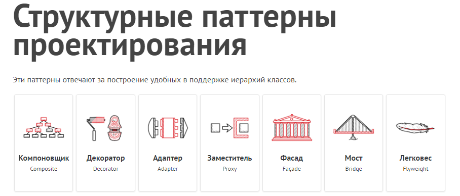
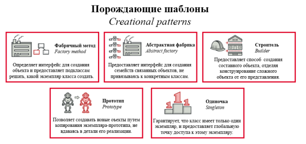

# Паттерны проектирования в Android



## Введение

Паттерны проектирования - это типовые решения часто встречающихся проблем в разработке программного обеспечения.

Они помогают создавать более поддерживаемый и гибкий код.

## **Категории паттернов**



### **1. Порождающие паттерны (Creational)**

Отвечают за удобное и безопасное создание новых объектов или даже целых семейств объектов.

#### **Singleton Одиночка**

* **Цель:** Гарантирует существование только одного экземпляра класса

* **Применение:** База данных, настройки приложения

* **Пример:**

````kotlin

object DatabaseHelper {

    fun getInstance(): DatabaseHelper = this

}

````

#### **Factory Method Фабрика**

* **Цель:** Создание объектов без явной привязки к конкретным классам

* **Применение:** Создание UI элементов

* **Особенности:** Позволяет делегировать создание объектов наследникам


### **2. Структурные паттерны (Structural)**

Отвечают за построение удобных в поддержке иерархий классов.

#### **Adapter Адаптер**

* **Цель:** Позволяет объектам с несовместимыми интерфейсами работать вместе

* **Применение:** Интеграция старого кода с новым

* **Особенности:** Оборачивает несовместимый объект в новый интерфейс

#### **Decorator Декоратор**

* **Цель:** Динамическое добавление функциональности объектам

* **Применение:** Расширение функциональности View

* **Особенности:** Альтернатива наследованию


### 3. **Поведенческие паттерны (Behavioral)**

Решают задачи эффективного и безопасного взаимодействия между объектами.

#### **Observer Наблюдатель**

* **Цель:** Определяет зависимость "один-ко-многим" между объектами

* **Применение:** LiveData, Flow, обновление UI

* **Особенности:** Издатель-подписчик модель

#### **Strategy** **Стратегия**

* **Цель:** Определяет семейство алгоритмов и делает их взаимозаменяемыми

* **Применение:** Разные способы обработки данных

* **Особенности:** Инкапсуляция алгоритмов


## 💡**Применение в Android**

### **UI слой**

* Builder для AlertDialog

* Factory для создания View

* Observer для обновления UI

### **Бизнес-логика**

* Strategy для алгоритмов

* State для управления состоянием

* Command для действий пользователя

### **Данные**

* Singleton для базы данных

* Repository для доступа к данным

* Adapter для RecyclerView

## 📱 **Лучшие практики**

1. **Выбор паттерна:**

   - Используйте паттерны для решения конкретных проблем

   - Не усложняйте код без необходимости

   - Учитывайте контекст и требования

2. **Реализация:**

   - Следуйте принципам SOLID

   - Пишите чистый и понятный код

   - Документируйте сложные моменты

3. **Тестирование:**

   - Паттерны должны упрощать тестирование

   - Пишите модульные тесты

   - Проверяйте граничные случаи

## \## ⚠️**Антипаттерны**

4. Overengineering - излишнее усложнение

4. God Object - объект, знающий слишком много

4. Singleton Abuse - злоупотребление синглтонами

## 📚 Полезные ресурсы

* [Шаблоны проектирования с человеческим лицом](https://habr.com/ru/companies/vk/articles/325492/)

* 
  * [\# Паттерны проектирования для новичков](https://blog.skillfactory.ru/glossary/pattern/)
* 
  * [\# Паттерн (шаблон)](https://habr.com/ru/companies/vk/articles/325492/)
* 
  * [\# Шаблоны (паттерны) проектирования для людей](https://github.com/design-patterns-for-humans/Russian)\*\*\*\*
* [Refactoring.guru](https://refactoring.guru/ru/design-patterns)

* [Android Patterns](https://developer.android.com/reference/android/util/Patterns)

* [Распространенные паттерны проектирования и архитектуры приложений на Android](https://swiftbook.org/tutorials/rasprostranennye-patterny-proektirovaniya-i-arhitektury-prilozheniy-na-android/)

* [Kotlin Design Patterns](https://kotlin.github.io/kotlinx.coroutines/kotlinx-coroutines-core/kotlinx.coroutines.flow/-flow/)

## 🎥 Видео материалы

[](https://www.youtube.com/watch?v=9HJ55_fCtGg&pp=ygU40J_QsNGC0YLQtdGA0L3RiyDQv9GA0L7QtdC60YLQuNGA0L7QstCw0L3QuNGPINCyIEFuZHJvaWQ%3D)

[](https://www.youtube.com/watch?v=dusPvKaH7nE&pp=ygU40J_QsNGC0YLQtdGA0L3RiyDQv9GA0L7QtdC60YLQuNGA0L7QstCw0L3QuNGPINCyIEFuZHJvaWQ%3D)
